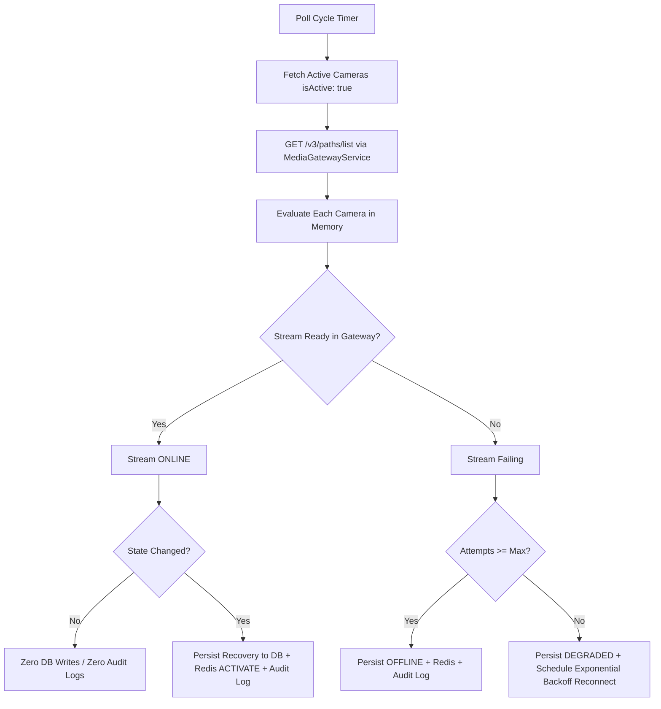

# NETRAVAHA — CAMERA HEALTH MONITORING & AUTOMATED RECONNECTION
## Production-Grade Health Loop & Bounded Reconnect Specification (Phase 4)
*Gujarat Police Innovation Challenge 2026 — Unified CCTV Intelligence Platform*

---

> [!IMPORTANT]
> **Engineering Scope & Compliance Disclaimers**:
> 1. *Architecture designed toward the 80,000-camera challenge target; current validation uses synthetic/test camera records.*
> 2. *No real government CCTV feeds or live police networks are connected in development or testing.*
> 3. *MediaMTX control API (`/v3/paths/list` and `/v3/paths/get/<path>`) is the authoritative source for gateway-level stream readiness.*

---

## 1. Operational Health Model

The camera health lifecycle is modeled deterministically using the canonical Prisma `OperationalStatus` enum:

| State | Gateway Signal | Telemetry & Criteria | System Action |
| :--- | :--- | :--- | :--- |
| **`ONLINE`** | MediaMTX reports `ready: true` on path | Active readable stream; frames or bytes arriving; 0 recent decode drops | Stream confirmed active; AI Worker consumer maintained; zero database writes during steady state. |
| **`DEGRADED`** | MediaMTX reports `ready: false` or path is not delivering data | Stream interrupted or gateway disconnected, but retry policy has NOT been exhausted (`reconnectAttempts < maxAttempts`) | Status updated in DB/Redis; `CAMERA_HEALTH_DEGRADED` audit log recorded; bounded exponential backoff reconciliation triggered. |
| **`OFFLINE`** | Stream missing/unreadable AND retry policy exhausted | `reconnectAttempts >= maxAttempts`; external source unreachable | Status updated in DB/Redis; `CAMERA_RECONNECT_EXHAUSTED` & `CAMERA_OFFLINE` audit logs emitted; retry loop halted. |
| **`ERROR`** | Authentication 401/403, invalid config, or unrecoverable gateway failure | Source rejected credentials; credential decryption failure; malformed endpoint URL | Status marked `ERROR`; `CAMERA_ERROR` audit log emitted (zero secrets); recovery requires manual credential rotation or valid probe. |

---

## 2. Background Polling Architecture

Health inspection is implemented as a background service: [`CameraHealthPollerService`](file:///d:/web%20project/gujcamera/backend/src/modules/cameras/health/camera-health-poller.service.ts).

### Polling Mechanism & Timing
- **Timer Loop**: Uses recursive `setTimeout` scheduling rather than `setInterval` to guarantee that overlapping polling cycles can never occur.
- **Configurable Cycle**: Governed by environment variable `CAMERA_HEALTH_POLL_INTERVAL_MS` (default: `15000` ms).
- **Batch Concurrency**: Configurable via `CAMERA_HEALTH_POLL_BATCH_SIZE` (default: `50` cameras per batch).

---

## 3. Authoritative Gateway Relationship (MediaMTX v3)

Instead of opening a redundant TCP/RTSP connection from the backend for every camera (which would cause severe resource exhaustion across 80,000 feeds), the backend relies on **MediaMTX** as the authoritative video gateway:

1. **Batch State Retrieval (`GET /v3/paths/list`)**:
   - In a single HTTP request, MediaMTX provides the runtime state of all paths:
     - `ready`: boolean (true if source is connected and readers can consume)
     - `tracks`: active track identifiers (video, audio)
     - `bytesReceived`: ingress telemetry
     - `readers`: active downstream consumer sessions (e.g. AI worker)
2. **Individual Path State (`GET /v3/paths/get/<path>`)**:
   - Used for single camera deep-dive inspection during `GET /api/v1/cameras/:id/health`.
3. **No Redundant Reconnect Fighting**:
   - MediaMTX natively retries external RTSP sources when configured with `source`.
   - The backend poller observes this readiness; it only intervenes to re-register paths if MediaMTX was restarted or dropped the configuration, and to track backoff transitions.

---

## 4. Database Write Storm Prevention (Zero-Write Steady State)

A core requirement for scalability toward 80,000 cameras is preventing database write storms:

- **In-Memory Tracking**: [`CameraHealthPollerService`](file:///d:/web%20project/gujcamera/backend/src/modules/cameras/health/camera-health-poller.service.ts) maintains a per-camera state map:
  - `cameraId`, `pathName`, `status`, `consecutiveFailures`, `reconnectAttempts`, `nextReconnectAt`, `lastSeenAt`, `lastSuccessAt`, `lastTransitionAt`, `failureReason`.
- **`ONLINE -> ONLINE` Steady State**:
  - Yields **zero PostgreSQL transactions** (`camera.update` and `cameraHealth.upsert` are NOT called).
  - Yields **zero AuditLog records**.
  - Yields **zero Redis Pub/Sub events**.
- **State Transition Only**:
  - Database writes occur strictly on genuine state changes (`ONLINE -> DEGRADED`, `DEGRADED -> OFFLINE`, `OFFLINE -> ONLINE`, `* -> ERROR`).

---

## 5. Bounded Exponential Backoff Reconnection

When a stream drops:
1. Status transitions to `DEGRADED`.
2. The poller schedules reconnection according to:
   $$\text{delay} = \min(\text{CAMERA\_RECONNECT\_INITIAL\_DELAY\_MS} \times 2^{\text{attempt}}, \text{CAMERA\_RECONNECT\_MAX\_DELAY\_MS})$$
3. Defaults:
   - Initial delay: `2000` ms
   - Max delay: `30000` ms
   - Max attempts: `5` attempts
4. When `attempt >= maxAttempts`, retry halts and status becomes `OFFLINE`.
5. When the stream recovers (`ready: true` in MediaMTX), status returns to `ONLINE`, and counters reset (`reconnectAttempts = 0`, `consecutiveFailures = 0`).

---

## 6. Security & Credential Protection

- **Zero Secret Leakage**:
  - Reconnection resolves credentials directly from [`LocalEncryptedCredentialProvider`](file:///d:/web%20project/gujcamera/backend/src/modules/cameras/credentials/local-encrypted-credential.provider.ts) in memory.
  - Plaintext passwords are never stored in `CameraHealthPollerService` properties.
  - Plaintext passwords are never written to `AuditLog`, Redis channels, or exception messages.
- **Decommission Safety**:
  - When `decommissionCamera` is executed, `forgetCamera(id)` is invoked.
  - An inactive camera (`isActive === false`) is never monitored or resurrected.
- **Credential Rotation Safety**:
  - When credentials rotate, `notifyCredentialRotated(id)` resets retry state so the health poller reconciles fresh credentials immediately.

---

## 7. Observability Metrics

The service collects operational telemetry accessible via `GET /api/v1/cameras/health/summary`:
- `camerasChecked`: Total active cameras scanned in the latest cycle.
- `camerasOnline`: Total cameras with active streams.
- `camerasDegraded`: Cameras experiencing temporary disconnects or in retry backoff.
- `camerasOffline`: Cameras with exhausted retry loops.
- `camerasError`: Cameras with configuration or authentication failures.
- `reconnectAttempts`: Cumulative reconnection attempts.
- `reconnectSuccesses`: Successful reconciliations.
- `reconnectFailures`: Failed gateway registrations.
- `healthCheckFailures`: MediaMTX API reachability errors.
- `lastPollDurationMs`: Duration of the last evaluation cycle in milliseconds.
- `totalPollCycles`: Cumulative background cycles executed.

---

## 8. Scalability Boundary & Future Horizontal Scaling

- **Current Implementation (Single Instance)**:
  - Bounded batching (chunks of 50 cameras).
  - Single batch HTTP request to MediaMTX `/v3/paths/list`.
  - In-memory state evaluation takes < 10ms for hundreds of cameras with 0 DB writes.
- **Scaling Toward 80,000 Cameras**:
  - When expanding beyond a single backend node, partition camera health monitoring across worker instances using consistent hashing on `camera.id` or Redis-based distributed locks (`Redlock`).
  - MediaMTX instances can be organized hierarchically or clustered with edge ingestion nodes.
