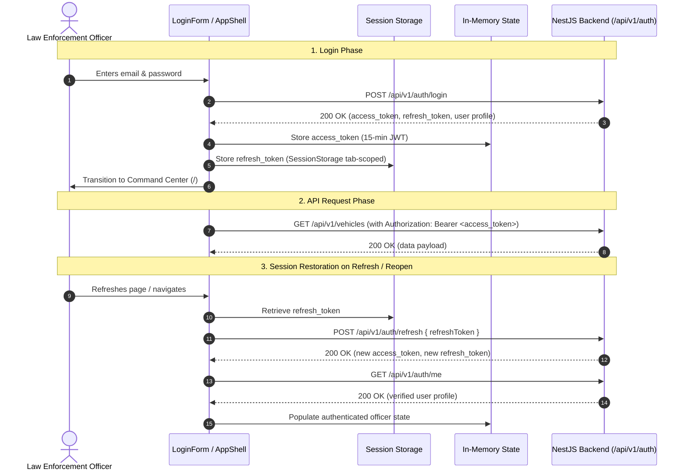

# Phase 4A Implementation Report — Frontend Foundation, Authentication Shell & Base Design System

**Gujarat Police Innovation Challenge 2026 — Unified CCTV Intelligence Platform**
**Document Reference:** `docs/PHASE_4A_IMPLEMENTATION.md`
**Canonical Source of Truth:** `master_architecture.md` (Sections 5.2, 8.1, 14, 15, 17, 20 & 24)
**Status:** IMPLEMENTED, TESTED & VERIFIED

---

## 1. Executive Summary

Phase 4A delivers the production-quality frontend foundation, authentication infrastructure, authenticated application shell, and centralized design system for the Gujarat Police Unified CCTV Intelligence Platform.

Built against the greenfield `frontend/` directory, this phase provides the mission-critical control-room interface that subsequent vertical slices (Phase 4B GIS Map, Phase 4C Live Monitoring, Phase 4D Vehicle Tracking, Phase 4E Alerts, Phase 4F Admin/Audit) will mount directly without architectural rework.

### Core Architectural Deliveries:
1. **Next.js 14 App Router Foundation:** Native TypeScript in strict mode, Vanilla CSS and centralized design tokens (zero Tailwind bloat, minimal dependencies).
2. **Police Command Design System:** Dark-first control-room aesthetic (`#06090f` base), WCAG AA contrast compliance, monospace license plate typography, mission-critical status/severity tokens, and the mandatory persistent **"SIMULATED DATA"** banner.
3. **Session Security & In-Memory Token Management:** Strict isolation of short-lived JWT access tokens in memory (never written to LocalStorage), refresh token lifecycle managed in `sessionStorage`, and seamless session restoration.
4. **Real Authentication & Login Screen:** Fully integrated against the live NestJS backend (`POST /api/v1/auth/login`, `POST /api/v1/auth/refresh`, `GET /api/v1/auth/me`), supporting real law enforcement identities and quick-select demo presets.
5. **Authenticated Application Shell:** Persistent left navigation rail, dynamic header bar, role-based navigation filtering across all 5 canonical police roles (`SUPER_ADMIN`, `DEPARTMENT_ADMIN`, `INVESTIGATOR`, `OPERATOR`, `SYSTEM_AUDITOR`), and instant sign-out.
6. **Honest Placeholder Route Architecture:** Professional, honest placeholder screens for future modules (`/live`, `/map`, `/vehicles`, `/watchlist`, `/alerts`, `/audit`, `/admin`) clearly indicating their planned phase and architectural section, with **zero mock data or fake functionality**.
7. **Comprehensive Test Suite:** 22 automated Vitest tests covering LoginForm validation, AuthContext lifecycle, AppShell protection, RBAC navigation rules, ApiClient token injection, and error envelope parsing.

---

## 2. Frontend Architecture

### 2.1 Technology Stack & Dependency Justification

| Dependency | Version | Type | Justification / Architectural Role |
|---|:---:|:---:|---|
| `next` | `^14.2.23` | Production | Next.js framework for App Router, routing, static optimization, and production server. |
| `react` | `^18.3.1` | Production | Core UI component model. |
| `react-dom` | `^18.3.1` | Production | DOM rendering engine for React. |
| `lucide-react` | `^0.468.0` | Production | Standard tree-shakeable icon set for tactical police command UI (Shield, Video, MapPin, Car, BellRing, Settings, Lock). |
| `typescript` | `^5.6.3` | Development | Static typing in strict mode for production correctness. |
| `@types/node`, `@types/react`, `@types/react-dom` | Latest | Development | Type definitions for Node.js and React. |
| `vitest` | `^2.1.8` | Development | High-speed unit & component test runner with native TypeScript and DOM simulation. |
| `jsdom` | `^25.0.1` | Development | Headless browser DOM implementation for component testing. |
| `@testing-library/react`, `jest-dom`, `user-event` | Latest | Development | User-centric DOM testing utilities. |

*(Total new dependencies: 4 production, 7 development. Zero heavy component libraries, zero CSS-in-JS runtime overhead).*

### 2.2 Directory Structure
```text
frontend/
├── package.json
├── tsconfig.json
├── next.config.mjs
├── vitest.config.ts
├── test-setup.ts
├── .env.example
├── .gitignore
├── app/
│   ├── layout.tsx                       # Root HTML shell with AuthProvider & global CSS
│   ├── page.tsx                         # Command Center dashboard (Phase 4A foundation)
│   ├── login/page.tsx                   # Full-screen police login interface
│   ├── live/page.tsx                    # Live Monitoring placeholder (Phase 4C)
│   ├── map/page.tsx                     # GIS Camera Map placeholder (Phase 4B)
│   ├── vehicles/page.tsx                # Vehicle Investigation placeholder (Phase 4D)
│   ├── watchlist/page.tsx               # Watchlist Management placeholder (Phase 4E)
│   ├── alerts/page.tsx                  # Real-Time Alerts placeholder (Phase 4E)
│   ├── audit/page.tsx                   # Audit Trail placeholder (Phase 4F)
│   └── admin/page.tsx                   # Fleet Admin placeholder (Phase 4F)
├── components/
│   ├── auth/
│   │   └── LoginForm.tsx                # Login form with validation, error banner, and demo presets
│   ├── layout/
│   │   ├── AppShell.tsx                 # Protected layout wrapper with sidebar, header & route guard
│   │   ├── Header.tsx                   # Top navigation bar with breadcrumbs & simulated badge
│   │   └── Sidebar.tsx                  # Left navigation rail with RBAC module filtering
│   └── ui/
│       ├── ErrorState.tsx               # Standardized error presenter with request correlation ID
│       ├── LoadingState.tsx             # Accessible radar pulse loading state
│       ├── PlaceholderPage.tsx          # Honest feature-stage notice component
│       ├── SimulatedDataBadge.tsx       # Mandatory persistent SIMULATED DATA badge
│       └── StatusBadge.tsx              # WCAG AA status and role badge
├── lib/
│   ├── api/
│   │   └── client.ts                    # Centralized HTTP client (JWT injection, refresh, request ID)
│   └── auth/
│       ├── context.tsx                  # React AuthContext and useAuth hook
│       ├── rbac.ts                      # Canonical roles, navigation matrix, and role formatters
│       └── session.ts                   # In-memory access token + sessionStorage refresh token manager
├── styles/
│   ├── globals.css                      # CSS reset, tactical scrollbars, font utilities
│   └── tokens.css                       # Centralized design tokens (colors, spacing, radii, typography)
├── types/
│   ├── api.ts                           # ApiError class, ApiErrorPayload, RequestOptions
│   └── auth.ts                          # PoliceRole, PoliceUser, LoginResponse, AuthState
└── __tests__/
    ├── ApiClient.test.tsx               # Client headers, error parsing, network handling tests
    ├── AppShell.test.tsx                # Shell layout, authentication gating, user identity tests
    ├── AuthContext.test.tsx             # Session restore, login, logout lifecycle tests
    ├── LoginForm.test.tsx               # Form validation, preset selection, submit tests
    ├── PlaceholderPage.test.tsx         # Honest phase labeling and governance tests
    └── RbacNavigation.test.tsx          # Role-based menu visibility tests
```

---

## 3. Route Structure

| Route | Minimum Permitted Role | Implementation Status | Screen Description |
|---|---|:---:|---|
| `/login` | Public | **IMPLEMENTED** | Law enforcement authentication screen with demo presets and validation. |
| `/` | Authenticated (All Roles) | **IMPLEMENTED** | Command Center home view, officer profile card, and subsystem readiness overview. |
| `/live` | `OPERATOR+` | **PLACEHOLDER** | Live Video Monitoring & HLS CCTV matrix (Scheduled: Phase 4C). |
| `/map` | `VIEWER+` | **PLACEHOLDER** | GIS Camera Map with MapLibre GL clustering & spatial bbox queries (Scheduled: Phase 4B). |
| `/vehicles` | `INVESTIGATOR+` | **PLACEHOLDER** | License plate search, sighting history, and route velocity reconstruction (Scheduled: Phase 4D). |
| `/watchlist`| `INVESTIGATOR+` | **PLACEHOLDER** | Flagged vehicle catalog, priority assignment, and active status control (Scheduled: Phase 4E). |
| `/alerts` | `OPERATOR+` | **PLACEHOLDER** | Real-time alert feed, WebSocket engine, and lifecycle triage (Scheduled: Phase 4E). |
| `/audit` | `SYSTEM_AUDITOR`, `SUPER_ADMIN` | **PLACEHOLDER** | Compliance audit trail, action before/after diffs, and correlation IDs (Scheduled: Phase 4F). |
| `/admin` | `DEPARTMENT_ADMIN`, `SUPER_ADMIN` | **PLACEHOLDER** | Fleet onboarding, camera GPS/connector configuration (Scheduled: Phase 4F). |

---

## 4. Authentication Flow & Session Management Strategy



### Security Architecture & Tradeoff Disclosure:
- **In-Memory Access Tokens:** The short-lived access token (15-minute validity) is stored exclusively in a JavaScript module-level memory closure (`inMemoryAccessToken`). It is **never** written to `localStorage` or `sessionStorage`, mitigating token extraction via Cross-Site Scripting (XSS).
- **Session-Scoped Refresh Tokens:** The refresh token is kept in `sessionStorage` rather than `localStorage`. This guarantees that closing the browser tab or window destroys the session, preventing persistent session hijacking on shared police terminal workstations.
- **Automatic Token Refresh Interceptor:** The centralized API client (`lib/api/client.ts`) detects HTTP 401 errors on authenticated endpoints, transparently exchanges the refresh token for a new access token, updates memory, and replays the failed request before forcing a user logout.

---

## 5. RBAC Navigation Behavior

Navigation visibility is strictly governed by the officer's authenticated role:

```text
┌─────────────────────────┬─────────────┬────────────┬──────────────┬───────────┬────────────────┬────────┐
│ Command Module          │ SUPER_ADMIN │ DEPT_ADMIN │ INVESTIGATOR │ OPERATOR  │ SYSTEM_AUDITOR │ VIEWER │
├─────────────────────────┼─────────────┼────────────┼──────────────┼───────────┼────────────────┼────────┤
│ Command Center (/)      │      ✅     │     ✅     │      ✅      │     ✅    │       ✅       │   ✅   │
│ Live Monitoring (/live) │      ✅     │     ✅     │      ✅      │     ✅    │       ❌       │   ❌   │
│ GIS Camera Map (/map)   │      ✅     │     ✅     │      ✅      │     ✅    │       ✅       │   ✅   │
│ Vehicles (/vehicles)    │      ✅     │     ✅     │      ✅      │     ✅    │       ❌       │   ❌   │
│ Watchlists (/watchlist) │      ✅     │     ✅     │      ✅      │     ✅    │       ❌       │   ❌   │
│ Alert Engine (/alerts)  │      ✅     │     ✅     │      ✅      │     ✅    │       ❌       │   ❌   │
│ Audit Trail (/audit)    │      ✅     │     ❌     │      ❌      │     ❌    │       ✅       │   ❌   │
│ Fleet Admin (/admin)    │      ✅     │     ✅     │      ❌      │     ❌    │       ❌       │   ❌   │
└─────────────────────────┴─────────────┴────────────┴──────────────┴───────────┴────────────────┴────────┘
```

*Note on Security Boundary:* As mandated by `master_architecture.md`, frontend RBAC is a user-experience convenience layer. The backend authorization guards (`JwtAuthGuard`, `RolesGuard`) enforce the immutable server-side security boundary on every REST endpoint.

---

## 6. Design System Foundation

Centralized in `styles/tokens.css` and `styles/globals.css`:
- **Surface Palette:**
  - Base canvas: `#06090f`
  - Primary panel: `#0b0f19`
  - Secondary card: `#111726`
  - Elevated surface: `#1f2b45`
- **Border Palette:** Subtly delineated `#1c2638` and `#25334d` with clear focus rings (`#3b82f6`).
- **Typography:** Primary interface in `Inter`, monospace elements (license plates, timestamps, request correlation IDs) in `'JetBrains Mono', 'Fira Code', monospace`.
- **Status & Severity Signals:**
  - Critical / Alert: `#ef4444` (background: `rgba(239, 68, 68, 0.12)`)
  - Warning: `#f59e0b` (background: `rgba(245, 158, 11, 0.12)`)
  - Info / Medium: `#3b82f6` (background: `rgba(59, 130, 246, 0.12)`)
  - Success / Online: `#10b981` (background: `rgba(16, 185, 129, 0.12)`)
- **Simulated Data Indicator:** Persistent amber banner with warning triangle icon (`SIMULATED DATA (DEMO FIXTURES)`) displayed in the header and on login to clearly designate synthetic CCTV streams.

---

## 7. Testing & Quality Gates

### A. Frontend Test Results (Vitest)
Executed via `npm run test` in `frontend/`:
```text
 ✓ __tests__/RbacNavigation.test.tsx (6 tests)
 ✓ __tests__/ApiClient.test.tsx (4 tests)
 ✓ __tests__/AuthContext.test.tsx (3 tests)
 ✓ __tests__/PlaceholderPage.test.tsx (1 test)
 ✓ __tests__/AppShell.test.tsx (3 tests)
 ✓ __tests__/LoginForm.test.tsx (5 tests)

 Test Files  6 passed (6)
      Tests  22 passed (22)
   Duration  1.82s
```

### B. Next.js Production Build
Executed via `npm run build` in `frontend/`:
```text
 ✓ Compiled successfully
 ✓ Linting and checking validity of types ...
 ✓ Generating static pages (12/12)
 ✓ Finalizing page optimization ...

Route (app)                              Size     First Load JS
┌ ○ /                                    2.03 kB         106 kB
├ ○ /_not-found                          873 B          88.2 kB
├ ○ /admin                               1.93 kB         106 kB
├ ○ /alerts                              2.1 kB          106 kB
├ ○ /audit                               1.95 kB         106 kB
├ ○ /live                                1.97 kB         106 kB
├ ○ /login                               6.42 kB        93.7 kB
├ ○ /map                                 2 kB            106 kB
├ ○ /vehicles                            2.03 kB         106 kB
└ ○ /watchlist                           1.97 kB         106 kB
```

### C. Backend Regression & Verification
- **TypeScript Compilation:** `npm run build` passed with 0 errors.
- **Database Verification:** `npm run db:verify` passed 11/11 checks.
- **Backend E2E Suite:** `npm run test:e2e` passed all 120 tests across 7 test suites.
- **Formatting:** `git diff --check` passed cleanly with 0 whitespace errors.

---

## 8. Exact Manual Verification Steps

1. **Ensure Infrastructure is Running:**
   ```bash
   docker compose ps
   # All 6 containers should be Up (healthy)
   ```

2. **Start Backend Server:**
   ```bash
   cd backend
   npm run start:dev
   # Backend listening at http://localhost:4000/api/v1
   ```

3. **Start Frontend Server:**
   ```bash
   cd frontend
   npm run dev
   # Frontend running at http://localhost:3000
   ```

4. **Test Real Authentication & Session:**
   - Navigate to `http://localhost:3000` in a web browser.
   - You will be automatically redirected to `http://localhost:3000/login`.
   - Click the **"Control Room Operator"** preset button (populates `operator.demo@gujcamera.local` / `PoliceDemo@2026!`).
   - Click **"Authenticate Session"**.
   - You are redirected to `/` (Command Center) displaying:
     - Officer: `operator.demo@gujcamera.local`
     - Role: `Control Room Operator`
     - Department: `Ahmedabad City Police Commissionerate`
     - Subsystem pipeline readiness indicators.
     - Persistent `SIMULATED DATA` badge in top header.
     - Navigation rail with 6 permitted modules (Fleet Admin & Audit Trail are hidden).

5. **Test Role-Based Navigation Differences:**
   - Click **"Sign Out"** in the sidebar. You are redirected back to `/login`.
   - Click the **"System Auditor"** preset button (`auditor.demo@gujcamera.local` / `PoliceDemo@2026!`) and log in.
   - Observe the navigation rail: **"Audit Trail"** is visible, while Live Monitoring, Vehicles, and Fleet Admin are hidden.
   - Click **"Sign Out"** and log in with **"Super Admin"** (`admin.demo@gujcamera.local`).
   - Observe that all 8 tactical command modules are visible.

6. **Test Honest Placeholder Pages:**
   - Click on **"Live Monitoring"** (`/live`): Displays the Phase 4C notice with architectural references and no fake video tiles.
   - Click on **"GIS Camera Map"** (`/map`): Displays the Phase 4B notice detailing MapLibre GL integration.
   - Click on **"Vehicle Tracking"** (`/vehicles`): Displays the Phase 4D notice.

---

## 9. Known Limitations & Scope Discipline

- **Placeholders are Honest:** As instructed, video playback, interactive maps, live alert feeds, and vehicle search tables are **not built in Phase 4A**. They will be implemented in subsequent dedicated vertical slices.
- **WebSocket Gateway Deferred:** Real-time WebSockets will be introduced in Phase 4E alongside the live alert feed.

---

## 10. Architectural Boundary Compliance

- **Tailwind CSS:** Excluded. Vanilla CSS / CSS Modules used throughout.
- **Mock Data:** Prohibited and avoided. No fake camera streams or synthetic charts were created.
- **Database Schema:** Zero modifications to `backend/prisma/schema.prisma`. Zero migrations created.
- **Backend Business Logic:** Unmodified. All existing endpoints and guards preserved.
- **Secrets:** Zero `.env` files or credentials committed to Git.
