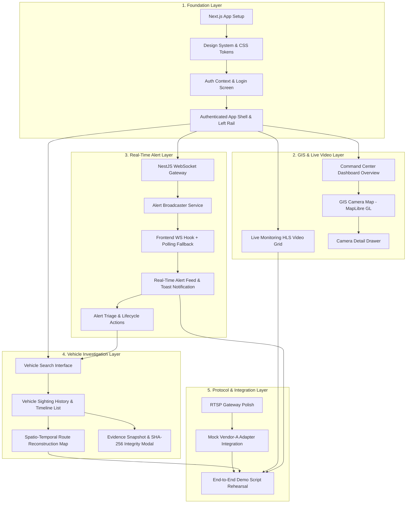

# Phase 4 Readiness & Implementation Audit

**Gujarat Police Innovation Challenge 2026 — Unified CCTV Intelligence Platform**
**Document Reference:** `docs/PHASE_4_READINESS.md`
**Canonical Source of Truth:** `master_architecture.md` (Sections 3, 5, 6, 7, 8, 9, 10, 11, 12, 14, 15, 16, 17, 18, 20, 23 & 24)
**Status:** AUDIT & PLANNING COMPLETE — READY FOR PHASE 4 EXECUTION

---

## 1. Executive Summary

Phases 0 through 3G of the Unified CCTV Intelligence Platform have been implemented, hardened, verified, and frozen:
- **Phase 0:** Repository, multi-container Docker infrastructure, network isolation.
- **Phase 1:** PostgreSQL 16 + PostGIS 3.4 canonical schema, spatial indices, 19 tables.
- **Phase 2B:** NestJS backend foundation, JWT authentication, 5-tier RBAC, synchronous audit logging.
- **Phase 2C:** Camera Registry, spatial bounding box queries (`ST_DWithin`, `ST_MakeEnvelope`), health monitoring.
- **Phase 2D:** Vehicle tracking, plate normalization, chronological sightings, PostGIS route reconstruction with velocity plausibility filtering.
- **Phase 2E:** Watchlist engine, priority triage, alert state machine, alert deduplication.
- **Phase 3A:** MediaMTX RTSP/HLS gateway, FFmpeg CCTV stream simulator, deterministic fixtures.
- **Phase 3B/3C:** Python AI Vision Worker, frame sampling, YOLOv8n vehicle detection, heuristic license plate localization.
- **Phase 3D:** Tesseract OCR, Indian license plate normalization, regex validation.
- **Phase 3E:** Multi-frame plate consensus (5–8 frames), MinIO S3 evidence vault, SHA-256 integrity verification.
- **Phase 3F:** Redis Streams decoupled event boundary (`vehicle.sighting_created` v1.0), NestJS consumer group, atomic `$transaction` persistence, idempotent ingestion.
- **Phase 3G:** CPU performance benchmarking (11.7 FPS sustained, 85.17 ms avg wall-clock), 12-stage full pipeline automated E2E test suite, zero-regression certification.

**The Current Phase 4 Mission:**
The backend data engine, vision pipeline, event bus, and storage layers are fully operational. However, the operational user experience required by `master_architecture.md`—specifically the **Command Center Web UI**, **Live Video Monitoring**, **GIS Camera Map**, **Real-Time WebSocket Alerts**, and **Protocol Federation Adapters**—remains to be built.

This audit evaluates current repository readiness, maps every architectural capability to concrete source files, identifies all gaps, reconciles official challenge requirements, and defines the precise implementation path for Phase 4.

---

## 2. Repository State

### 2.1 Workspace Structure
```text
gujcamera/
├── .env.example                          # Environment template (zero hardcoded secrets committed)
├── docker-compose.yml                    # 6 core services defined with health checks & network isolation
├── master_architecture.md                # Canonical architectural specification (v1.1)
├── ai-worker/                            # Python 3.11 Computer Vision & Ingestion Worker
│   ├── app/
│   │   ├── config.py                     # Configuration with strict consensus window bounds (5–8)
│   │   ├── consensus/                    # Multi-frame plate voting & consensus service
│   │   ├── detector/                     # YOLOv8n detector & heuristic plate localizer
│   │   ├── domain/                       # Pure domain models (Detection, ConsensusResult, EvidenceRecord)
│   │   ├── events/                       # Redis Streams publisher & event contract v1.0
│   │   ├── evidence/                     # MinIO S3 uploader & SHA-256 integrity calculator
│   │   ├── ocr/                          # Tesseract OCR & Indian plate normalization
│   │   ├── stream_consumer.py            # OpenCV RTSP stream consumer & frame sampler
│   │   └── main.py                       # Vision pipeline coordinator & worker loop
│   ├── models/                           # Bundled YOLOv8n model weights
│   └── tests/                            # 107 pytest unit & benchmark tests (100% passing)
├── backend/                              # NestJS 10 Modular Monolith REST Backend
│   ├── prisma/
│   │   ├── schema.prisma                 # Canonical Prisma schema (19 models, PostGIS extension)
│   │   ├── seed.ts                       # Demonstration seed script (Gujarat Police hierarchy & fixtures)
│   │   └── verify.ts                     # Database integrity verification script (11/11 checks)
│   ├── src/
│   │   ├── common/                       # Guards, filters, interceptors, request-id, Redis stream consumer
│   │   ├── modules/
│   │   │   ├── alerts/                   # Alert engine, lifecycle state machine, watchlist matching
│   │   │   ├── auth/                     # JWT authentication, session refresh, bcrypt password hashing
│   │   │   ├── cameras/                  # Camera registry, GIS spatial queries, health tracking
│   │   │   ├── health/                   # Infrastructure health probe (Postgres, Redis, MinIO, MediaMTX)
│   │   │   ├── users/                    # User management & department bindings
│   │   │   ├── vehicles/                 # Vehicle search, sightings history, spatio-temporal route reconstruction
│   │   │   └── watchlists/               # Watchlist management & entry flagging
│   │   └── main.ts                       # Server bootstrap, Helmet, CORS, Swagger (/api/docs), global pipes
│   └── test/                             # 120 Jest E2E tests across 7 test suites (100% passing)
├── frontend/                             # Command Center Web UI
│   └── .gitkeep                          # CURRENTLY EMPTY — RESERVED FOR PHASE 4
├── video-gateway/                        # MediaMTX & FFmpeg Deterministic CCTV Simulation
│   ├── fixtures/                         # Deterministic video fixtures (traffic_junction_day, night_highway)
│   ├── mediamtx.yml                      # MediaMTX gateway config (RTSP :8554, HLS :8888)
│   └── stream-loop.sh                    # FFmpeg continuous loop publisher
└── docs/                                 # Documentation & Phase Verification Reports
    ├── API.md                            # Comprehensive REST API specification (910 lines)
    ├── DATABASE.md                       # Canonical database schema & PostGIS architecture
    ├── PHASE_2_READINESS.md              # Phase 2 readiness review
    ├── PHASE_3D_OCR.md                   # OCR & normalization verification
    ├── PHASE_3E_CONSENSUS_EVIDENCE.md    # Multi-frame consensus & MinIO evidence verification
    ├── PHASE_3F_EVENT_INGESTION.md       # Redis Streams event ingestion verification
    └── PHASE_3G_BENCHMARK_E2E.md         # Benchmark results & full pipeline E2E test documentation
```

### 2.2 Live Container Infrastructure
All six Docker containers are active and passing health checks:
```text
NAME                         IMAGE                           STATUS                 PORTS
gujcamera_postgres           postgis/postgis:16-3.4-alpine   Up 3 hours (healthy)   0.0.0.0:5432->5432/tcp
gujcamera_redis              redis:7-alpine                  Up 3 hours (healthy)   0.0.0.0:6379->6379/tcp
gujcamera_minio              minio/minio:latest              Up 3 hours (healthy)   0.0.0.0:9000-9001->9000-9001/tcp
gujcamera_video_gateway      bluenviron/mediamtx:1.9.3       Up 3 hours (healthy)   0.0.0.0:8554->8554/tcp, 0.0.0.0:8888->8888/tcp
gujcamera_stream_simulator   linuxserver/ffmpeg:latest       Up 3 hours             -
gujcamera_ai_worker          gujcamera-ai-worker             Up (healthy)           -
```

### 2.3 Automated Test Baseline
- **AI Worker Unit & Benchmark Tests:** 107 passed, 0 failed (including 3 Phase 3G benchmarks).
- **Backend E2E Tests:** 120 passed, 0 failed across 7 test suites (`app`, `cameras`, `vehicles`, `watchlists`, `alerts`, `events-ingestion`, `full-pipeline`).
- **Database Verification:** 11 passed, 0 failed (`npm run db:verify`).
- **TypeScript Build:** 0 errors (`npm run build`).
- **Git Formatting:** Clean (`git diff --check`).

---

## 3. Existing Architecture-to-Code Mapping

| Architecture Capability | Backend Module / Path | AI Worker Component | Database Models | API Endpoint / Stream | Status |
|---|---|---|---|---|:---:|
| **Authentication & RBAC** | `backend/src/modules/auth/`, `backend/src/common/guards/` | N/A | `User`, `Role`, `Permission`, `Department` | `POST /api/v1/auth/login`, `GET /auth/me`, `POST /auth/refresh` | **COMPLETE** |
| **Audit Logging** | Injected in services (`recordAuditLog`) | N/A | `AuditLog` | Synchronous write on security actions; read endpoint pending | **COMPLETE (Writes)** |
| **Camera Registry** | `backend/src/modules/cameras/` | N/A | `Camera`, `Location`, `CameraStream`, `Connector` | `POST /api/v1/cameras`, `GET /api/v1/cameras`, `GET /api/v1/cameras/:id` | **COMPLETE** |
| **GIS Camera Spatial Query** | `backend/src/modules/cameras/cameras.service.ts` | N/A | `Camera` (lat/long), PostGIS spatial index | `GET /api/v1/cameras?bbox=`, `GET /api/v1/cameras/nearby` | **COMPLETE** |
| **Camera Health Monitoring** | `backend/src/modules/cameras/`, `health/` | `ai-worker/app/health.py` | `CameraHealth` | `GET /api/v1/health`, `PATCH /cameras/:id/status` | **COMPLETE** |
| **Video Streaming Gateway** | Configuration in `video-gateway/` | `ai-worker/app/stream_consumer.py` | `CameraStream` (`urlOrHandle`) | RTSP `:8554`, HLS `:8888` | **COMPLETE** |
| **Vehicle & Plate Detection** | N/A | `ai-worker/app/detector/` | `Detection`, `PlateDetection` | OpenCV frame loop + YOLOv8n CPU | **COMPLETE** |
| **OCR & Normalization** | N/A | `ai-worker/app/ocr/` | N/A (Consensus feeds Sighting) | Tesseract 5.3.4 + Indian regex/fuzzy normalizer | **COMPLETE** |
| **Multi-Frame Consensus** | N/A | `ai-worker/app/consensus/` | N/A | Sliding window (5–8 frames, default 5) | **COMPLETE** |
| **Evidence Capture & Hash** | Handled in Sighting consumer | `ai-worker/app/evidence/` | `Evidence` | MinIO S3 Sighting JPEGs + SHA-256 verification | **COMPLETE** |
| **Event Boundary Publisher** | N/A | `ai-worker/app/events/` | N/A | Redis Stream: `gujcamera:events:vehicle-sightings` | **COMPLETE** |
| **Event Consumer & Ingestion** | `backend/src/common/events/consumers/` | N/A | `Vehicle`, `VehicleSighting`, `Evidence` | Group `gujcamera:backend:sightings-group` ($transaction) | **COMPLETE** |
| **Vehicle Search & Detail** | `backend/src/modules/vehicles/` | N/A | `Vehicle`, `VehicleSighting` | `GET /api/v1/vehicles`, `GET /api/v1/vehicles/:plate` | **COMPLETE** |
| **Vehicle Sightings History** | `backend/src/modules/vehicles/` | N/A | `VehicleSighting`, `Camera` | `GET /api/v1/vehicles/:plate/sightings` | **COMPLETE** |
| **Spatio-Temporal Route** | `backend/src/modules/vehicles/vehicles.service.ts` | N/A | `VehicleSighting`, `Camera` | `GET /api/v1/vehicles/:plate/timeline` | **COMPLETE** |
| **Watchlist Management** | `backend/src/modules/watchlists/` | N/A | `Watchlist`, `WatchlistEntry` | `GET /api/v1/watchlists`, `POST /watchlists`, `POST /watchlists/:id/entries` | **COMPLETE** |
| **Alert Engine & Triage** | `backend/src/modules/alerts/` | N/A | `Alert` | `GET /api/v1/alerts`, `PATCH /alerts/:id`, `/acknowledge`, `/resolve` | **COMPLETE** |
| **Real-Time WebSocket Alerts**| Not implemented | N/A | N/A | `WS /ws/alerts` (Specified in master_architecture.md §8.2) | **MISSING** |
| **Command Center Frontend** | N/A | N/A | N/A | UI Screen routes (`/`, `/live`, `/map`, `/vehicles`, `/alerts`) | **MISSING** |
| **Protocol Federation Layer**| Stored in `connectors` table | Direct RTSP only | `Connector` | Abstracted connector adapters (ONVIF / Mock Vendor) | **PARTIAL** |

---

## 4. MUST-HAVE Traceability Matrix

Every MUST-HAVE item specified in `master_architecture.md` (Section 17 & Section 24) is audited below:

| # | MUST-HAVE Requirement | Current Implementation State | Exact Files / Modules | UI Status | Test Status | Remaining Work | Priority | Classification |
|---|---|---|---|---|---|---|:---:|:---:|
| 1 | **Camera Registry + GIS** | Full CRUD, spatial bbox filtering, distance calculations via PostGIS | `backend/src/modules/cameras/` | **MISSING** | 20 E2E tests passing | MapLibre GL frontend integration, camera table & drawer | P1 | **PARTIAL** |
| 2 | **≥2 Real Protocol Adapters** | RTSP operational via MediaMTX & OpenCV; ONVIF / Mock Vendor present in schema & seed only | `video-gateway/mediamtx.yml`, `cameras.service.ts` | **MISSING** | RTSP verified in E2E; second adapter unverified | Implement second protocol adapter (ONVIF Profile S or Emulated Vendor API) | P2 | **PARTIAL** |
| 3 | **ANPR with Multi-Frame Consensus** | YOLOv8n + plate crop + Tesseract OCR + 5–8 frame consensus voting | `ai-worker/app/consensus/`, `ai-worker/app/ocr/` | **N/A** (Backend/AI) | 107 AI tests, 12 E2E tests passing | None (Fully operational and benchmarked at 11.7 FPS) | P1 | **COMPLETE** |
| 4 | **Cross-Camera Vehicle Tracking + Timeline + Route** | PostGIS distance calculation, elapsed seconds, velocity calculation, plausibility score | `backend/src/modules/vehicles/` | **MISSING** | 21 E2E tests passing | Vehicle search screen, timeline list view, MapLibre route polyline | P1 | **PARTIAL** |
| 5 | **Watchlist Matching** | Active watchlist matching against normalized plates, automated alert generation | `backend/src/modules/watchlists/`, `backend/src/modules/alerts/` | **MISSING** | 22 watchlist + 19 alert E2E tests passing | Watchlist management table, create entry modal | P1 | **COMPLETE (API)** |
| 6 | **Real-Time Alerts (WS + Polling Fallback)** | REST alert endpoints & filtering complete; WebSocket gateway and client polling fallback absent | `backend/src/modules/alerts/` | **MISSING** | 19 E2E tests passing for REST | Add `@nestjs/websockets` gateway (`/ws/alerts`), hook into alert creation, build UI toast/drawer | P1 | **PARTIAL** |
| 7 | **RBAC + Audit Log** | 5 canonical roles, JWT guards, synchronous audit logging on sensitive actions | `backend/src/modules/auth/`, `guards/`, `schema.prisma` | **MISSING** | 17 Auth E2E tests passing | Login screen, role-aware navigation rail, audit log viewer screen | P1 | **PARTIAL** |
| 8 | **Evidence Capture (Frame + Hash)** | MinIO S3 JPEG storage, SHA-256 calculation & DB persistence, exact-byte verification | `ai-worker/app/evidence/`, `schema.prisma` | **MISSING** | E2E & unit verified | Evidence detail viewer modal with SHA-256 integrity badge | P1 | **PARTIAL** |
| 9 | **Working Live End-to-End Demonstration** | Full pipeline verified via automated test script against deterministic CCTV fixtures | `backend/test/full-pipeline.e2e-spec.ts` | **MISSING** | 12/12 pipeline tests passing | Interactive web command center enabling real-time human operator walkthrough | P0 | **PARTIAL** |

---

## 5. Frontend Audit

1. **Framework State:**
   - The directory `frontend/` currently contains only `.gitkeep`.
   - No `package.json`, build configuration, or frontend source code currently exists.
2. **Framework Alignment with `master_architecture.md`:**
   - Section 5.2 explicitly specifies: `FE [Next.js Frontend]`.
   - Technology Stack: Next.js (App Router or Pages Router), TypeScript, Vanilla CSS / CSS Modules for design system control, MapLibre GL for GIS maps.
3. **State Management & Data Fetching:**
   - Lightweight state management (React Context / Hooks) for auth session and alert queue.
   - Axios or native `fetch` client with interceptors for `Authorization: Bearer <token>`, `X-Request-Id` injection, and standardized error extraction.
4. **Design System & Aesthetics Compliance:**
   - Section 15 mandates **dark-first** control room aesthetic, high-contrast monospace fonts for plate display (`0/O`, `1/I` distinction), WCAG AA compliance, and persistent **"SIMULATED DATA"** badges for demo fixtures.
5. **Real-Time Architecture:**
   - Native browser WebSocket / Socket.io client connecting to `/ws/alerts` with automatic reconnection and a 5-second polling fallback to `GET /api/v1/alerts?status=NEW`.

---

## 6. UI Screen Readiness

Comparing the existing implementation against the 15 screens specified in `master_architecture.md` (Section 14.2):

| # | Screen | Master Architecture Route / Purpose | API Endpoint Dependency | Backend Readiness | UI Screen State | Demo Importance |
|---|---|---|---|:---:|:---:|:---:|
| 1 | **Login** | Authenticate user, obtain JWT | `POST /api/v1/auth/login` | **READY** | **MISSING** | Low (Essential) |
| 2 | **Dashboard / Command Center** | At-a-glance KPIs, recent alerts, system status | `GET /cameras`, `/alerts`, `/health` | **READY** | **MISSING** | Medium |
| 3 | **GIS Camera Map** | MapLibre map, viewport bbox query, status markers | `GET /api/v1/cameras?bbox=` | **READY** | **MISSING** | **HIGH** |
| 4 | **Camera Registry & Detail** | Fleet table, department filters, camera detail drawer | `GET /api/v1/cameras`, `GET /cameras/:id` | **READY** | **MISSING** | Medium |
| 5 | **Live Monitoring** | Video-tile grid (HLS stream playback), offline badges | MediaMTX HLS `:8888/{stream}/index.m3u8` | **READY** | **MISSING** | **HIGH** |
| 6 | **Vehicle Search** | Search by normalized plate or prefix, last-seen range | `GET /api/v1/vehicles?search=` | **READY** | **MISSING** | **HIGH** |
| 7 | **Vehicle Detail & Timeline** | Ordered sightings list, confidence badges, evidence links | `GET /api/v1/vehicles/:plate/sightings` | **READY** | **MISSING** | **HIGH** |
| 8 | **Vehicle Route (GIS)** | Spatial route reconstruction, polyline, velocity legend | `GET /api/v1/vehicles/:plate/timeline` | **READY** | **MISSING** | **HIGH** |
| 9 | **Watchlist Management** | Active flagged plates, add entry form, priority badges | `GET /api/v1/watchlists`, `POST /entries` | **READY** | **MISSING** | Medium |
| 10 | **Alerts Feed & Triage** | Real-time alert list, severity badges, ack/resolve actions | `GET /api/v1/alerts`, `PATCH /alerts/:id` | **READY** | **MISSING** | **HIGH** |
| 11 | **Evidence Viewer** | Modal/viewer, JPEG render, SHA-256 integrity check | MinIO presigned / proxy URL, S3 hash | **READY** | **MISSING** | Medium |
| 12 | **Camera Health** | Fleet health board, uptime & packet loss status | `GET /api/v1/health`, `GET /cameras` | **READY** | **MISSING** | Medium |
| 13 | **Audit Log Viewer** | Security & investigative audit trail | `AuditLog` model (query API pending) | **PARTIAL** | **MISSING** | Low |
| 14 | **Admin / Users** | User accounts and department role assignment | `schema.prisma` models & seed | **READY** | **MISSING** | Low |
| 15 | **Incident / Investigation** | Case view linking multiple alerts and evidence | `Incident` model (query API pending) | **PARTIAL** | **MISSING** | Low (Future) |

**Smallest Implementation for a Complete Demo Flow:**
The 6 **HIGH**-importance screens (Login, Command Center / GIS Map, Live Monitoring, Vehicle Search / Timeline / Route, and Real-Time Alerts) represent the core user journey required to demonstrate the platform.

---

## 7. Live Video Readiness

1. **Gateway & Streaming Infrastructure:**
   - MediaMTX runs in container `gujcamera_video_gateway`.
   - RTSP input port `8554` receives streams from the FFmpeg `stream-simulator` looping `traffic_junction_day.mp4` (`cam-ahm-01`) and `night_highway.mp4` (`cam-ahm-02`).
   - RTSP stream endpoints:
     - `rtsp://localhost:8554/cam-ahm-01`
     - `rtsp://localhost:8554/cam-ahm-02`
2. **Browser Playback Compatibility:**
   - HTML5 web browsers cannot play RTSP directly.
   - MediaMTX has native HLS remuxing enabled on port `8888` (`mediamtx.yml: hls: yes`, `hlsAddress: :8888`).
   - Browser HLS endpoints:
     - `http://localhost:8888/cam-ahm-01/index.m3u8`
     - `http://localhost:8888/cam-ahm-02/index.m3u8`
3. **Gateway Configuration Optimization for Demo:**
   - Currently, `mediamtx.yml` has `hlsAlwaysRemux: no`. This means remuxing only starts when the first HTTP request hits the HLS endpoint, introducing a 3–5 second cold-start delay.
   - **Recommendation:** Update `mediamtx.yml` to set `hlsAlwaysRemux: yes` and configure 1-second segment lengths (`hlsSegmentDuration: 1s`, `hlsPartDuration: 200ms`) for near real-time, zero-lag browser playback during demonstrations.

---

## 8. Protocol Adapter Readiness

1. **Architectural Requirement:**
   - Section 24 mandates **"≥2 real protocol adapters"** under the MUST-HAVE column.
   - Section 16 classifies:
     - Adapter 1: RTSP/ONVIF adapter (Real implementation against real/simulated RTSP feed).
     - Adapter 2: Mock "Vendor A" adapter (Proves the federation adapter pattern generalizes across heterogeneous vendor protocols).
2. **Current Implementation Status:**
   - **RTSP Adapter:** **REAL & FULLY OPERATIONAL**. Implemented in `ai-worker/app/stream_consumer.py` via OpenCV RTSP transport and MediaMTX.
   - **ONVIF / Vendor Adapter:** **PARTIAL / CONTRACT ONLY**. The database has the `Connector` model (`adapterType: 'ONVIF'`, `'MOCK_VENDOR'`), but no active network client communicates over ONVIF SOAP/WS-Discovery or an emulated vendor HTTP API.
3. **Smallest Credible Two-Adapter PoC Implementation:**
   - **Adapter 1 (Standard RTSP / MediaMTX):** Connects to any standard H.264 RTSP feed (e.g. `cam-ahm-01`).
   - **Adapter 2 (Simulated Vendor-A REST/HTTP Snapshot Adapter):** A lightweight protocol adapter module simulating a proprietary vendor camera API (e.g. Hikvision ISAPI / Dahua HTTP API). It polls or receives periodic frame snapshots and metadata, feeding them through the same canonical detection pipeline, proving the federation pattern without requiring physical vendor proprietary hardware on demo day.

---

## 9. Real-Time Alert Readiness

1. **Current Alert Generation & Persistence:**
   - Post-consensus sightings published to Redis Streams are ingested by `SightingEventConsumer`.
   - Ingested sightings are checked against active watchlist plates in `AlertsService.processSightingMatch`.
   - Matching sightings atomically generate `Alert` records (`status: NEW`, `severity: CRITICAL` or watchlist priority).
   - Duplicate delivery protection prevents duplicate alert records.
2. **What Is Currently Missing:**
   - **WebSocket Gateway:** NestJS backend lacks a WebSocket Gateway module (`@nestjs/websockets`, `@nestjs/platform-socket.io` or `ws`).
   - **Real-Time Notification Emission:** `AlertsService` creates the DB record but does not currently emit an event to a WebSocket broadcaster.
   - **Client Polling Fallback:** Frontend needs a resilient hook that attempts a WebSocket connection to `WS /ws/alerts` and falls back seamlessly to a 5-second polling interval against `GET /api/v1/alerts?status=NEW` if the WebSocket disconnects.

---

## 10. Cross-Camera Tracking Readiness

1. **Distinction of Tracking Capabilities:**
   - **Same-Camera Tracking:** Handled during frame sampling and multi-frame consensus (5–8 frames) within a single camera stream.
   - **Plate-Based Cross-Camera Correlation:** **FULLY IMPLEMENTED & TESTED**. `VehiclesService.getVehicleTimeline` correlates consecutive sightings of the same normalized plate across different cameras, calculates real geodesic distance (via PostGIS), elapsed time, implied speed (km/h), and flags speed anomalies.
   - **Probabilistic Visual Re-Identification Without Plates:** **EXPLICITLY NOT BUILT** (mandated by Section 10 and Section 24).
2. **Current API Contract:**
   - `GET /api/v1/vehicles/:plate/timeline` returns:
     - Ordered `sightings` with camera metadata, GPS coordinates, and timestamp.
     - Calculated `route_segments` with `distance_meters`, `elapsed_seconds`, `estimated_speed_kmh`, and `is_plausible`.
     - Route summary with total distance, average speed, and plausibility score.
     - Explicit legal/operational disclaimer: *"Observed movement between camera observations; does not represent an exact physical driving route or turn-by-turn navigation."*
3. **Frontend Requirement:**
   - Render the timeline as an interactive chronological list.
   - Render the reconstructed route on a MapLibre GL map with connected polyline segments colored by plausibility.

---

## 11. Security Readiness

1. **Authentication & Session:**
   - JWT access tokens (15-minute expiry) signed with `JWT_SECRET`.
   - Refresh token rotation supported via `POST /api/v1/auth/refresh`.
   - Passwords hashed with `bcryptjs` (salt rounds = 10).
2. **Role-Based Access Control (RBAC):**
   - 5 canonical roles: `SUPER_ADMIN`, `DEPARTMENT_ADMIN`, `INVESTIGATOR`, `OPERATOR`, `SYSTEM_AUDITOR`.
   - Enforced server-side via `JwtAuthGuard` and `RolesGuard`.
   - Public routes explicitly exempted using `@Public()`.
3. **Department Data Isolation (IDOR Protection):**
   - `DEPARTMENT_ADMIN` users can only onboard cameras and create watchlists for their assigned department (`user.departmentId === dto.departmentId`).
4. **Audit Logging:**
   - Synchronous audit logging to `AuditLog` table on all security actions (login, alert transitions, watchlist updates, evidence exports).
5. **Security Gaps / Needs for Phase 4:**
   - Read API for audit logs (`GET /api/v1/audit`) so the System Auditor role can inspect compliance in the UI.
   - WebSocket authentication: Ensure the WebSocket gateway authenticates the JWT bearer token upon initial handshake.

---

## 12. Testing Readiness

1. **Current Automated Test Suite:**
   - AI Worker: 107 tests passing (`pytest tests/ -v`).
   - Backend E2E: 120 tests passing across 7 suites (`npm run test:e2e`).
   - Database Verification: 11 checks passing (`npm run db:verify`).
   - Compilation: TypeScript builds with 0 errors (`npm run build`).
2. **Phase 4 Testing Requirements:**
   - **WebSocket E2E Test:** Automated test verifying that creating an alert triggers a real-time WebSocket push to connected test clients.
   - **Frontend Unit & Component Tests:** Vitest / React Testing Library tests for authentication context, alert toast, and camera map rendering.
   - **Interactive User Journey E2E Test:** Playwright or Cypress test validating the end-to-end user journey in a real browser.

---

## 13. Demo Critical Path

Mapping the actual repository capability against the 13-stage Hackathon Demonstration Script (Section 23):

```text
[1. LOGIN] ───────────► [2. COMMAND CENTER] ─────► [3. GIS CAMERA MAP]
  (API: Ready)            (API: Ready)                (API: Ready)
  (UI:  Missing)          (UI:  Missing)              (UI:  Missing)
        │
        ▼
[4. LIVE MONITORING] ─► [5. VEHICLE DETECTION] ──► [6. ANPR CONSENSUS]
  (HLS: Ready)            (AI:  Ready)                (AI:  Ready)
  (UI:  Missing)          (Pipeline: Ready)           (Pipeline: Ready)
        │
        ▼
[7. EVENT BOUNDARY] ──► [8. DB PERSISTENCE] ─────► [9. WATCHLIST MATCH]
  (Redis: Ready)          (Postgres: Ready)           (Alerts: Ready)
        │
        ▼
[10. REAL-TIME ALERT] ─► [11. EVIDENCE VAULT] ───► [12. TIMELINE & ROUTE]
  (REST: Ready)           (MinIO: Ready)              (PostGIS: Ready)
  (WS:   Missing)         (Hash:  Ready)              (UI Map:  Missing)
  (UI:   Missing)         (UI:    Missing)
```

| Step | User Journey Beat | System Action | Backend / AI Status | UI Status | Demonstration Readiness |
|:---:|---|---|:---:|:---:|:---:|
| 1 | Operator logs in | `POST /auth/login` | **READY** | MISSING | **PARTIAL** |
| 2 | View Command Center overview | View fleet KPI summary and active alerts | **READY** | MISSING | **PARTIAL** |
| 3 | Explore GIS Camera Map | View camera pins clustered across Gujarat | **READY** | MISSING | **PARTIAL** |
| 4 | Open Live Camera tile | Stream video feed via HLS (:8888) | **READY** | MISSING | **PARTIAL** |
| 5 | Vehicle passes CCTV camera | Stream simulator feeds frame to AI worker | **READY** | N/A | **READY** |
| 6 | Plate detected & confirmed | YOLO + Tesseract 5-frame consensus | **READY** | N/A | **READY** |
| 7 | Evidence stored & event emitted | MinIO upload + Redis Stream XADD | **READY** | N/A | **READY** |
| 8 | Event ingested & persisted | NestJS consumer transaction in Postgres | **READY** | N/A | **READY** |
| 9 | Flagged plate matches watchlist | Alert generated (`status: NEW`) | **READY** | N/A | **READY** |
| 10 | Real-time alert pops up on screen | WebSocket push to operator UI | **PARTIAL** | MISSING | **BLOCKED** |
| 11 | Operator clicks alert for evidence | View snapshot JPEG and SHA-256 hash | **READY** | MISSING | **PARTIAL** |
| 12 | Investigator searches plate | View chronological sightings across cameras | **READY** | MISSING | **PARTIAL** |
| 13 | View reconstructed vehicle route | MapLibre route polyline + speed metrics | **READY** | MISSING | **PARTIAL** |

---

## 14. Phase 4 Dependency Graph



---

## 15. Recommended Phase 4 Breakdown

To ensure disciplined, low-risk progress without sprawling changes, Phase 4 should be executed in strict vertical slices:

### **Phase 4A: Frontend Foundation, Authentication Shell & Base Design System**
- Initialize Next.js in `frontend/` with TypeScript and Vanilla CSS / CSS Modules.
- Implement Design System tokens from Section 15 (dark-first theme, monospace plate styling, WCAG AA contrast, persistent `SIMULATED DATA` badge).
- Build `AuthContext`, JWT session management, token refresh handling, and `Login` screen.
- Implement authenticated application shell with persistent left navigation rail.

### **Phase 4B: Command Center Dashboard & GIS Camera Map**
- Build the Command Center home view with fleet status summary cards and recent activity.
- Implement the interactive GIS Camera Map using MapLibre GL with clustering, status pins (Online, Offline, Degraded), and viewport-bounded querying.
- Build the Camera Registry table and Camera Detail drawer.

### **Phase 4C: Live Video Monitoring & HLS Video Grid**
- Configure MediaMTX for low-latency HLS remuxing (`hlsAlwaysRemux: yes`).
- Implement the Live Monitoring video grid in the frontend using `hls.js`.
- Add stream health indicators, camera metadata overlays, and fullscreen tile mode.

### **Phase 4D: Vehicle Investigation Workflow (Search, Timeline & Route)**
- Build the Vehicle Search interface with prefix matching and date filtering.
- Implement the Vehicle Detail screen and chronological Sightings Timeline.
- Implement the Spatio-Temporal Route Reconstruction view on MapLibre GL, rendering route polylines, transit speed callouts, and plausibility warnings.
- Build the Evidence Viewer modal displaying the snapshot JPEG, capture timestamp, camera metadata, and SHA-256 integrity verification badge.

### **Phase 4E: Watchlist Management & Real-Time Alert Engine**
- Implement NestJS WebSocket Gateway (`/ws/alerts`) with JWT handshake authentication.
- Connect `AlertsService` to broadcast `alert.created` and `alert.updated` events.
- Build frontend WebSocket client with automatic reconnection and a 5-second polling fallback.
- Implement the real-time Alert Feed, priority audio/toast notifications, and alert lifecycle triage actions (Acknowledge, Investigate, Resolve, Dismiss).
- Build the Watchlist Management interface (CRUD for flagged plates and priority categories).

### **Phase 4F: Evidence Vault, System Diagnostics & Audit Log Viewer**
- Implement read endpoint for audit logs (`GET /api/v1/audit`).
- Build the Audit Log Viewer screen for the `SYSTEM_AUDITOR` role.
- Build the Fleet Diagnostics & System Health screen.

### **Phase 4G: Protocol Federation Adapter & Full Demo Rehearsal**
- Implement the second protocol adapter (Simulated Vendor-A REST snapshot adapter).
- Wire the second adapter into the ingestion pipeline.
- Conduct full rehearsals of the 13-stage demonstration script against synthetic CCTV fixtures.

---

## 16. Risks / Blockers

1. **Browser Video Playback Latency:**
   - Default HLS latency can introduce 4–6 seconds of buffering delay.
   - *Mitigation:* Configure MediaMTX for low-latency HLS (`hlsSegmentDuration: 1s`, `hlsPartDuration: 200ms`, `hlsAlwaysRemux: yes`) to achieve sub-2-second browser playback.
2. **Offline GIS Map Tiles:**
   - In a secure government or hackathon demonstration environment, public map tile servers (e.g. OpenStreetMap / Carto) may be blocked or firewalled.
   - *Mitigation:* Configure MapLibre GL to use high-availability vector/raster tile fallbacks or local static tile caches.
3. **WebSocket Connection Stability:**
   - Strict proxies or corporate firewalls can terminate persistent WebSocket connections.
   - *Mitigation:* Mandate the 5-second REST polling fallback (`GET /api/v1/alerts?status=NEW`) in the frontend architecture from Day 1.

---

## 17. Architecture Conflicts / Change-Control Items

1. **Official Challenge Requirement Reconciliation:**
   - `master_architecture.md` Section 1.2 carries stale wording stating that *Model 4* and official portal requirements are "UNKNOWN" or on "Hold".
   - **Current Verified Position:** Model 4 is officially confirmed as a valid Hybrid/Custom architecture combining Centralized Ingestion, Edge Processing, and Protocol Federation. Model 1 (Registry + GIS) is the mandatory foundation. The evaluation dataset uses recorded feeds simulated as live, and working software is explicitly required.
   - **Resolution:** No architectural rewrite is necessary. Our existing hybrid implementation (Model 1 Registry/GIS + MediaMTX Ingestion + AI Worker + Redis Streams + NestJS modular monolith) matches the official Model 4 hybrid specification.
2. **WebSocket Package Addition in Backend:**
   - `backend/package.json` currently lacks `@nestjs/websockets` and `@nestjs/platform-socket.io` (or `ws`).
   - **Resolution:** Approved as an intended Phase 4 addition to fulfill Section 8.2 (`WS /ws/alerts`) and Section 24 MUST-HAVE requirement #6.
3. **Prisma Schema Stability:**
   - The current schema (`schema.prisma`) already contains all necessary models (`Incident`, `AuditLog`, `Connector`, `CameraStream`, etc.).
   - **Resolution:** Zero database migrations or schema modifications are required for Phase 4.

---

## 18. Exact Next Step

### **Recommended Next Phase: Phase 4A — Frontend Foundation, Authentication Shell & Base Design System**

**Immediate Scope for Phase 4A:**
1. Initialize the Next.js application within the existing `frontend/` directory with TypeScript and Vanilla CSS / CSS Modules.
2. Implement the design system tokens adhering to Section 15 (control room dark theme, monospace license plate fonts, accessible status badges, persistent `SIMULATED DATA` flag).
3. Build the HTTP API client with JWT interceptors, automatic token refresh, and request ID propagation.
4. Implement the `Login` screen wired to `POST /api/v1/auth/login`.
5. Implement the authenticated application layout shell with a persistent left navigation rail and top status bar.
6. Verify authentication, session persistence, and RBAC-aware navigation via automated component/unit tests.
