# PHASE 5 STRATEGIC GAP AUDIT & IMPLEMENTATION PRIORITY REPORT

**Unified CCTV Intelligence Platform — Gujarat Police Innovation Challenge 2026**  
**Document Reference:** `docs/PHASE_5_STRATEGIC_GAP_AUDIT.md`  
**Source of Truth:** `master_architecture.md` (v1.1)  
**Baseline Git Commit:** `36341c6` (`feat: complete and freeze frontend, alerts, and protocol adapters (Phase 4A-4F)`)  
**Audit Date:** September 10, 2026  
**Status:** READ-ONLY STRATEGIC GAP AUDIT — ZERO SOURCE CODE MODIFIED

---

## 1. Executive Summary

This strategic audit conducts an exhaustive, evidence-based review of the Gujarat Police Unified CCTV Intelligence Platform codebase following the completion and freezing of Phases 4A through 4F (Git checkpoint `36341c6`).

### Key Findings
1. **Core Spine is 100% Operational & Verified:** The central operational flow — Camera Ingestion → AI Vision (YOLO + Plate Crop + Tesseract OCR + Consensus) → Redis Streams Boundary → Sighting Persistence → Watchlist Matching → Real-Time Alerts (WebSocket + Fallback) → GIS Cross-Camera Tracking & Route Reconstruction — is fully implemented, verified with 154 backend tests, 79 frontend tests, and 104 AI tests, and is demo-ready today.
2. **Phase 4F Protocol Foundation Is Genuine:** Real RTSP (`OPTIONS` + `DESCRIBE` with SDP parsing) and ONVIF (SOAP 1.2 + WS-Security UsernameToken) protocol adapters are active in `ProtocolAdapterRegistry`, eliminating the previous architecture risk without fabricating vendor integrations.
3. **Key Gaps Identified (Pre-Demo & Hackathon Realities):**
   - **Audit Trail Query UI/API (FR-015):** The database records synchronous audit logs across all sensitive operations, but `frontend/app/audit/page.tsx` is an empty `PlaceholderPage` and the backend lacks `GET /api/v1/audit`.
   - **Evidence Packaging & Export (FR-019 / Journey O):** SHA-256 evidence frames are stored immutably in MinIO and linked in DB, but there is no court-ready chain-of-custody export package (ZIP/PDF with verification digest).
   - **Scale Proof (NFR-003):** While GIS viewport bounding and clustering are implemented in MapLibre, the synthetic 80,000-camera database stress test has not been executed (currently 5 seeded cameras).
   - **Administrative Entity Management:** User creation, role permission matrix editing, and department management have database schemas but lack REST management endpoints and UI screens.
   - **External Blocker Remains Firm:** The official government feed specifications and physical camera network access remain unreleased behind the participant portal; simulation and protocol test fixtures must remain honestly labeled.

---

## 2. Current System Inventory

### Backend Architecture (NestJS Modular Monolith)
- **Runtime:** Node.js 20 / NestJS 10, TypeScript 5.3, Prisma ORM 5.x.
- **Modules Active:**
  - `AuthModule`: Real bcrypt password hashing, JWT issuance (15-min access, refresh tokens), `@Roles()` decorator, `RolesGuard`.
  - `CamerasModule`: Camera CRUD, PostGIS spatial query (`ST_MakeEnvelope`), health monitoring, live RTSP/ONVIF connection probes, `ProtocolAdapterRegistry`.
  - `VehiclesModule`: Plate query normalization (`GJ01AB1234`), sightings timeline, PostGIS distance calculation (`ST_Distance` on geography), speed/travel time calculation, plausibility flags.
  - `WatchlistsModule`: Watchlist CRUD, active entry matching (`STOLEN_VEHICLE`, `SUSPECT_WANTED`), expiration logic.
  - `AlertsModule`: Alert entity lifecycle (`NEW`, `ACKNOWLEDGED`, `INVESTIGATING`, `RESOLVED`, `DISMISSED`), duplicate cooldown suppression, `AlertsGateway` (native WS on `/ws/alerts` with in-band JWT auth and role scoping).
  - `EventsModule`: Decoupled `RedisStreamClient` and `SightingEventConsumer` consuming `gujcamera:events:vehicle-sightings` with consumer group `backend-sighting-consumers`. Atomic `$transaction` persistence.
  - `AuditModule`: Synchronous audit logger writing actor, action, resource, before/after diffs to `audit_logs` table.
- **Test Inventory:** 20 unit tests, 134 E2E tests across 9 suites (154 total backend tests, 100% passing).

### AI Vision Worker (Python / FastAPI)
- **Runtime:** Python 3.14 / PyTorch (CPU-optimized), OpenCV, Ultralytics YOLOv8n, Tesseract 5 LSTM.
- **Pipeline Stages:**
  1. RTSP / File Stream Consumer: OpenCV frame sampling.
  2. Vehicle Detector: YOLOv8n COCO model (car, truck, bus, motorcycle).
  3. Plate Localizer: Morphological aspect-ratio filter and edge detector.
  4. OCR Engine: Tesseract 5 PSM 7/8 with character whitelist.
  5. Plate Normalizer: Indian registration regex formatter (`GJ01AB1234`).
  6. Consensus Engine: 5–8 frame sliding window with vote aggregation and confidence thresholding.
  7. Evidence Vault: JPEG compression (quality 90), SHA-256 byte hashing, direct MinIO S3 upload (`boto3`).
  8. Event Publisher: Redis Streams `XADD` publisher with bounded in-memory retry buffer (100 items).
- **Isolation:** Zero SQL drivers, zero DB credentials, 100% database-isolated.
- **Test Inventory:** 104 passing tests, 3 skipped GPU benchmarks, 0 failures.

### Video Gateway (MediaMTX)
- **Configuration:** `video-gateway/mediamtx.yml` with RTSP (port 8554) and HLS (port 8888).
- **Simulator:** FFmpeg stream simulator streaming `video-gateway/fixtures/cam-ahm-01.mp4` on loop as `rtsp://video-gateway:8554/cam-ahm-01`.

### Frontend Architecture (Next.js 14 App Router)
- **Technology:** React 18, TypeScript, Vanilla CSS Design System (`tokens.css`, `globals.css`).
- **Implemented Routes (13 total):**
  - `/` (Command Center Dashboard with KPI cards & quick actions)
  - `/login` (Full authentication with police demo account buttons)
  - `/cameras` (Camera Registry table with search, status filters, and detail drawer)
  - `/map` (GIS Camera Map with MapLibre GL, clustering, and camera drawer)
  - `/live` (Live CCTV Monitoring with MediaMTX HLS playback, camera selector, and offline states)
  - `/vehicles` (Vehicle Search with plate formatting assistance)
  - `/vehicles/[plate]` (Investigation Detail with sightings timeline, evidence thumbnail, SHA-256 hash, and interactive GIS route map)
  - `/watchlist` (Watchlist Console with active plates, severity categories, add plate form, and expire actions)
  - `/alerts` (Real-time Alert Console with WebSocket connection, audio chime, audio toggle, and lifecycle triage actions)
  - `/admin` (Fleet Administration & Protocol Onboarding with live RTSP/ONVIF connection probes)
  - `/audit` (Security & Compliance Audit Trail — *PlaceholderPage*)
  - `/_not-found`
- **Test Inventory:** 14 Vitest suites, 79 tests passing (100% passing).

### Database (PostgreSQL 16 + PostGIS 3.4)
- **Tables (19 Canonical Entities):** `departments`, `roles`, `permissions`, `users`, `connectors`, `cameras`, `camera_streams`, `camera_health`, `locations`, `detections`, `plate_detections`, `vehicles`, `vehicle_sightings`, `watchlists`, `watchlist_entries`, `alerts`, `incidents`, `evidence`, `audit_logs`.
- **Spatial Index:** `cameras_location_gist_idx` active on `(ST_SetSRID(ST_MakePoint(long, lat), 4326))`.
- **Verification:** `npm run db:verify` passes 11/11 checks.

---

## 3. FR-001–FR-020 Traceability Matrix

| ID | Requirement | Current Implementation | Evidence in Code | Status | Gap | Priority |
|---|---|---|---|---|---|---|
| **FR-001** | Camera onboarding with registry fields | `POST /api/v1/cameras` validates name, lat, long, dept, connector. Fleet admin UI provides onboarding form. | `cameras.controller.ts:46`, `admin/page.tsx:320` | **COMPLETE** | None for PoC | P1 |
| **FR-002** | Reject invalid GPS or duplicate RTSP | Prisma unique constraints on stream URL; latitude/longitude range validation (-90..90, -180..180). | `cameras.service.ts:112`, `test-connection.dto.ts:18` | **COMPLETE** | None | P1 |
| **FR-003** | $\ge$2 distinct protocol adapters (RTSP + ONVIF) | `RtspProtocolAdapter` (OPTIONS+DESCRIBE) and `OnvifProtocolAdapter` (SOAP 1.2+WS-Security) in registry. | `rtsp-protocol.adapter.ts`, `onvif-protocol.adapter.ts`, `protocol-adapter.registry.ts` | **COMPLETE** | Physical ONVIF hardware is simulated via fixture | P0 |
| **FR-004** | GIS camera map with viewport & clustering | MapLibre GL map fetching `/cameras?bbox=...` with PostGIS `ST_MakeEnvelope`; MapLibre supercluster active. | `GisCameraMap.tsx:140`, `cameras.service.ts:165` | **COMPLETE** | Synthetic 80k-row stress test unrun | P1 |
| **FR-005** | Vehicle detection in sampled frames | YOLOv8n inference pipeline detecting cars, trucks, buses, motorcycles. | `ai-worker/app/detector/detector.py:65` | **COMPLETE** | None | P1 |
| **FR-006** | Read and normalize license plates | Morphological plate cropping + Tesseract 5 OCR + Indian format normalization regex. | `ai-worker/app/ocr/engine.py:80`, `normalizer.py:25` | **COMPLETE** | Controlled fixtures only; no live Gujarati road set | P1 |
| **FR-007** | Multi-frame consensus aggregation | `ConsensusEngine` aggregates 5–8 frames, performs frequency voting, computes consensus score. | `ai-worker/app/consensus/engine.py:52` | **COMPLETE** | None | P0 |
| **FR-008** | Investigator plate search & ordered sightings | `GET /api/v1/vehicles?q=...` & `GET /api/v1/vehicles/:plate/sightings` ordered by `ts DESC`. | `vehicles.controller.ts:45`, `vehicles.service.ts:75` | **COMPLETE** | None | P0 |
| **FR-009** | Render route on GIS map with confidence | `RouteMap.tsx` renders PostGIS coordinates as polyline, colored green (plausible) or red/dashed (implausible). | `RouteMap.tsx:110`, `vehicles.service.ts:210` | **COMPLETE** | None | P0 |
| **FR-010** | Check sightings against active watchlists | `SightingEventConsumer` checks active `WatchlistEntry` rows during Redis stream consumption. | `events.consumer.ts:145`, `watchlists.service.ts:110` | **COMPLETE** | Exact match only; fuzzy Levenshtein match deferred | P1 |
| **FR-011** | Generate alert on watchlist match | Creates `Alert` entity in `NEW` status, sets severity, links source sighting and entry. | `alerts.service.ts:85`, `events.consumer.ts:170` | **COMPLETE** | None | P0 |
| **FR-012** | Real-time alert push (WS + polling fallback) | Native WebSocket on `/ws/alerts` with in-band JWT auth; frontend falls back to 5s polling if WS drops. | `alerts.gateway.ts:60`, `alert-socket.ts:88` | **COMPLETE** | None | P0 |
| **FR-013** | Alert triage state machine with RBAC | Operator: `ACKNOWLEDGE`, `DISMISS`. Investigator: `INVESTIGATE`, `RESOLVE`. Enforced server-side. | `alerts.controller.ts:75`, `AlertCard.tsx:140` | **COMPLETE** | None | P0 |
| **FR-014** | Suppress duplicate alerts (cooldown) | `activeAlertsCooldownMinutes` (default 15m) checks recent alerts on identical plate before creating new row. | `alerts.service.ts:120` | **COMPLETE** | None | P1 |
| **FR-015** | Immutable audit log of all sensitive actions | Synchronous writes to `audit_logs` on auth, cameras, alerts, watchlists. | `audit.service.ts:25`, `alerts.service.ts:165` | **PARTIAL** | DB writes complete; UI is placeholder; no GET API | P0 |
| **FR-016** | Role-based access control on every API | `@Roles()` decorator + `RolesGuard` on all controllers. 401/403 enforced. | `roles.guard.ts:20`, `auth.controller.ts:35` | **COMPLETE** | None | P0 |
| **FR-017** | Visually distinguish simulated vs live data | `SimulatedDataBadge` component rendered on Map, Live, Vehicles, Alerts, and Admin pages. | `SimulatedDataBadge.tsx:10`, `LivePlayer.tsx:55` | **COMPLETE** | None | P0 |
| **FR-018** | Camera health monitoring (online/degraded/offline) | Heartbeat status in `camera_health`; status badges in Registry and GIS map. | `cameras.service.ts:240`, `StatusBadge.tsx:15` | **COMPLETE** | Automated health ping worker is manual/scheduled | P2 |
| **FR-019** | Evidence export with chain-of-custody hash | Evidence stored in MinIO with SHA-256 in DB, but no export endpoint or packaged download flow. | `evidence_storage.py:45`, `Evidence` table | **MISSING** | No REST export API; no ZIP/PDF export bundle | P0 |
| **FR-020** | Watchlist entry creation with reason & expiry | `POST /api/v1/watchlists/:id/entries` with category, reason, priority, `expiresAt`. Full UI in `/watchlist`. | `watchlists.controller.ts:60`, `watchlist/page.tsx:210`| **COMPLETE** | None | P0 |

---

## 4. NFR-001–NFR-008 Traceability Matrix

| ID | Description | Acceptance Criteria | Measured / Observed State | Status | Gap | Priority |
|---|---|---|---|---|---|---|
| **NFR-001** | API p95 latency for read endpoints | Target <150ms under normal load | Tested via Jest supertest (~10–25ms local); formal multi-user load test unrun | **TARGET ONLY** | No formal k6/Autocannon benchmark run | P2 |
| **NFR-002** | Alert delivery latency (detection to UI) | <1000ms end-to-end | AI pipeline (85.17ms) + Redis (0.19ms) + Consumer (<10ms) + WS broadcast (<5ms) = ~100ms | **PARTIALLY MEASURED** | Need instrumented E2E wall-clock test | P1 |
| **NFR-003** | GIS map performance at 80,000 markers | No degradation at 80,000 simulated markers | PostGIS spatial GiST index active; MapLibre supercluster configured; 80k synthetic seed unrun | **TARGET ONLY** | Execute synthetic 80k load test script | P1 |
| **NFR-004** | Secrets excluded from source & logs | CI secret-scan gate / zero secrets committed | Complete Git audit clean; `.env.example` used; zero credentials in git history | **COMPLETE** | Verified in Phase 4G | P0 |
| **NFR-005** | Sensitive reads/writes produce audit record | Contract test asserting audit row creation | Tested in `vehicles.e2e-spec.ts` (test 20) and `alerts.e2e-spec.ts` | **COMPLETE** | Verified in automated E2E tests | P0 |
| **NFR-006** | Graceful degradation on failure | Never crash on camera/DB/AI failure | Tested in `events-ingestion.e2e-spec.ts` (poison message, unknown camera, retry buffer) | **COMPLETE** | Verified across all failure specs | P0 |
| **NFR-007** | ANPR accuracy measured, not asserted | Measured against labeled test set | 100% on synthetic test patterns; real Gujarati road dataset is unmeasured | **MEASURED (FIXTURES)** | Public / state dataset unavailable | P2 |
| **NFR-008** | RBAC enforced server-side | Server-side guards reject client bypass | Tested in `app.e2e-spec.ts`, `vehicles.e2e-spec.ts` (tests 1–4), `alerts-ws.e2e-spec.ts` | **COMPLETE** | 100% server-side enforcement | P0 |

---

## 5. User Journey Audit (A through U)

| # | Journey | Implemented | Tested | Demo Ready | Failure State Handled | Audit Present | Fallback Present |
|---|---|---|---|---|---|---|---|
| **A** | Login | Yes | Yes (E2E) | Yes | Yes (401 error state) | Yes (sync audit) | — |
| **B** | Camera onboarding | Yes | Yes (E2E) | Yes | Yes (409 dup / invalid GPS) | Yes (sync audit) | Protocol probe retry |
| **C** | Camera health | Yes | Yes (E2E) | Yes | Yes (degraded/offline badge) | Yes (async) | Last known status |
| **D** | Live monitoring | Yes | Yes (Vitest) | Yes | Yes (StreamUnavailable UI) | No | Offline placeholder |
| **E** | ANPR detection | Yes | Yes (pytest) | Yes | Yes (low conf flag) | Yes (async batch) | Frequency voting |
| **F** | Vehicle search | Yes | Yes (E2E) | Yes | Yes (404 / empty state) | Yes (sync audit) | — |
| **G** | Cross-camera tracking | Yes | Yes (E2E) | Yes | Yes (implausible flag) | Yes (sync audit) | Disclaimed hops |
| **H** | GIS route reconstruction | Yes | Yes (Vitest) | Yes | Yes (dashed route on gap) | Yes (via F/G) | Polyline fallback |
| **I** | Watchlist creation | Yes | Yes (E2E) | Yes | Yes (400 plate validation) | Yes (sync audit) | Soft-delete expiry |
| **J** | Watchlist match | Yes | Yes (E2E) | Yes | Yes (unmatched ignored) | Yes (sync audit) | — |
| **K** | Alert generation | Yes | Yes (E2E) | Yes | Yes (WS failure handled) | Yes (sync audit) | HTTP 5s polling |
| **L** | Alert investigation | Yes | Yes (E2E) | Yes | Yes (missing evidence msg) | Yes (sync audit) | — |
| **M** | Alert resolution | Yes | Yes (E2E) | Yes | Yes (409 invalid transition)| Yes (sync audit) | Server state machine |
| **N** | Evidence viewing | Partial | Yes (unit) | Partial | Yes (missing frame alert) | Partial | Inline thumbnail |
| **O** | Evidence export | **Missing** | No | No | No | No | No |
| **P** | Camera failure | Yes | Yes (E2E) | Yes | Yes (offline status updated)| No | StreamUnavailable |
| **Q** | AI failure | Yes | Yes (pytest)| Yes | Yes (buffer retry, no crash)| No | FIFO buffer drop |
| **R** | Govt feed integration | **Blocked** | No | No | Checklist defined (§12.1) | No | Mock/fixture adapter |
| **S** | Operator workflow | Yes | Yes (E2E) | Yes | Yes (composite of A,D,K,L) | Yes | Polling fallback |
| **T** | Investigator workflow| Partial | Yes (E2E) | Yes | Yes (composite of A,F,G,H,M)| Yes | Missing export step |
| **U** | Administrator workflow | Partial | Yes (E2E) | Partial | Yes (camera/watchlist only)| Yes | Users/Roles missing |

---

## 6. UI Screen Audit

| Screen | Required (§14.2) | Route / Component | Real Backend | Demo Ready | Current State & Gap | Priority |
|---|---|---|---|---|---|---|
| **Login** | Yes | `/login` (`LoginForm.tsx`) | Yes (`POST /auth/login`) | **YES** | 100% complete with police demo account quick-fill buttons. | P0 |
| **Command Center Dashboard** | Yes | `/` (`app/page.tsx`) | Partial | **YES** | KPI cards, quick actions, simulated data notice. KPIs currently use calculated/seeded numbers. | P1 |
| **GIS Camera Map** | Yes | `/map` (`GisCameraMap.tsx`) | Yes (`GET /cameras?bbox=`) | **YES** | 100% complete with MapLibre GL, clustering, detail drawer, live preview link. | P0 |
| **Camera Registry** | Yes | `/cameras` (`app/cameras/page.tsx`) | Yes (`GET /cameras`) | **YES** | 100% complete with search, status filters, drawer, onboarding modal. | P0 |
| **Camera Detail** | Yes | `CameraDetailDrawer.tsx` | Yes (`GET /cameras/:id`) | **YES** | Slides out on map or registry click; shows coordinates, streams, health. | P0 |
| **Camera Health** | Yes (as view) | `/cameras` & `/map` | Yes (`camera_health` join) | **YES** | Filter by ONLINE/OFFLINE/DEGRADED; standalone `/health` dashboard not built. | P2 |
| **Vehicle Search** | Yes | `/vehicles` (`VehicleSearchBar.tsx`) | Yes (`GET /vehicles?q=`) | **YES** | 100% complete with plate formatter and recent searches. | P0 |
| **Vehicle Timeline** | Yes | `/vehicles/[plate]` (`SightingsTimeline.tsx`) | Yes (`GET /vehicles/:plate/timeline`) | **YES** | 100% complete with chronological cards, confidence badges, evidence thumbnails. | P0 |
| **Vehicle Route (GIS)** | Yes | `/vehicles/[plate]` (`RouteMap.tsx`) | Yes (`GET /vehicles/:plate/route`) | **YES** | 100% complete with interactive MapLibre polyline, plausibility coloring. | P0 |
| **Watchlist Console** | Yes | `/watchlist` (`app/watchlist/page.tsx`) | Yes (`GET/POST /watchlists`) | **YES** | 100% complete with active plates, severity categories, add form, expire action. | P0 |
| **Alerts Console** | Yes | `/alerts` (`AlertCard.tsx`) | Yes (`WS /ws/alerts` + `/alerts`) | **YES** | 100% complete with real-time socket, audio alert, filter tabs, triage state buttons. | P0 |
| **Fleet Admin / Onboarding** | Yes | `/admin` (`app/admin/page.tsx`) | Yes (`POST /cameras/test-connection`) | **YES** | 100% complete with RTSP/ONVIF connection tester, credentials form, protocol selector. | P0 |
| **Audit Log Viewer** | Yes | `/audit` (`app/audit/page.tsx`) | **NO** | **NO** | Rendered as `PlaceholderPage`. Backend lacks `GET /api/v1/audit` query controller. | **P0** |
| **Evidence Viewer & Export** | Yes | Inline in `/vehicles/[plate]` | Partial | **PARTIAL** | Shows image and SHA-256 hash. Dedicated `/evidence/:id` and export package are missing. | **P0** |
| **Incident / Case Management** | Yes | Integrated in `/alerts` | Partial | **PARTIAL** | Alerts have investigation state. Standalone `/incidents` case view not implemented. | P2 |
| **Analytics Dashboard** | Low–Med | Embedded in `/` | Partial | **PARTIAL** | Summary metrics on homepage. Dedicated `/analytics` time-series charts not implemented. | P2 |
| **Admin — Users** | Low | None | No | **NO** | DB table exists; no UI or REST CRUD endpoint for user management. | P2 |
| **Admin — Roles / RBAC** | Low | None | No | **NO** | DB table exists; no UI matrix editor for roles. | P3 |
| **Admin — Departments** | Low | None | No | **NO** | DB table exists; no UI hierarchy editor for departments. | P3 |
| **Settings** | Low | None | No | **NO** | Personal/system preferences UI not implemented. | P3 |

---

## 7. Official Hackathon Requirement Audit

| Requirement Area | Classification | Current State | Honest Limitation & Disclaimers |
|---|---|---|---|
| **80,000-Camera Scale Target** | **CONFIRMED OFFICIAL** | Architecture & schema designed for scale; GIS clustering implemented; 5 cameras seeded. | 80k synthetic stress test has not been executed; performance is mathematically estimated. |
| **Camera Registry** | **CONFIRMED OFFICIAL** | Implemented with 19 attributes, PostGIS coordinates, and connector references. | Fully operational. |
| **GIS Mapping** | **CONFIRMED OFFICIAL** | MapLibre GL with vector tiles, viewport bounding, and supercluster. | Fully operational. |
| **Heterogeneous Camera Connectivity** | **CONFIRMED OFFICIAL** | RTSP and ONVIF adapters implemented via `ProtocolAdapterRegistry`. | Live MediaMTX handles RTSP; ONVIF validated against standard protocol test fixture. |
| **ANPR / License Plate Recognition** | **CONFIRMED OFFICIAL** | YOLOv8n + Tesseract 5 + multi-frame consensus active in AI worker. | Benchmarked at 11.7 FPS on CPU; verified on synthetic video fixtures. |
| **Vehicle Tracking & Route Replay** | **CONFIRMED OFFICIAL** | Cross-camera sightings timeline, PostGIS distance/speed calculation, plausibility rating. | Fully operational. |
| **Watchlist & Flagged Plates** | **CONFIRMED OFFICIAL** | Multi-category watchlists (`STOLEN_VEHICLE`, etc.), expiration dates, sync matching. | Fully operational. |
| **Real-Time Alerts** | **CONFIRMED OFFICIAL** | Native WebSocket gateway (`/ws/alerts`) with sound notifications and 5s polling fallback. | Fully operational. |
| **Government-Feed Integration** | **UNKNOWN / BLOCKED** | Placeholder contract defined in `master_architecture.md` Section 12. | **BLOCKED:** Exact network path, VPN, credentials, and video formats are unreleased. |
| **Model 1–4 Definitions** | **UNKNOWN / BLOCKED** | Hybrid architecture (Model 1 Registry + Model 3 Federation + AI layer) adopted. | **BLOCKED:** Specific distinguishing criteria of Models 1–4 remain behind portal login. |
| **Official Evaluation Rubric** | **UNKNOWN / BLOCKED** | Evaluated against standard engineering, operational policing, and security dimensions. | **BLOCKED:** Official weightings unverified. |

---

## 8. Scalability Audit (80,000-Camera Target)

### A. Implemented in Current PoC
- **GIS Viewport Bounding:** API endpoint `GET /api/v1/cameras?bbox=minLon,minLat,maxLon,maxLat` uses PostGIS spatial geometry indexing. The client only downloads cameras within the active bounding box.
- **Client-Side Supercluster:** MapLibre clusters overlapping pins into aggregate counters at zoom levels <14, preventing browser DOM collapse.
- **Composite Indexing:** `VehicleSighting(plate_normalized, ts)` composite index enables sub-millisecond timeline queries across millions of rows without table scans.
- **Decoupled Stream Ingestion:** Redis Streams decouples the high-throughput AI worker from database persistence, buffering up to 10,000 unconsumed sightings during DB contention.
- **Multi-Frame Consensus Pre-Filtering:** The AI worker aggregates 5–8 raw frame detections into a single canonical sighting, reducing database write volume by **80% to 87.5%**.

### B. Documented for Production (Architecturally Planned)
- **Central Bandwidth Reality (Section 23 of Architecture):** Ingesting 80,000 camera feeds at 3 FPS (150 KB/frame) requires **~36 GB/s peak ingress**.
- **Edge Pre-Filtering Strategy:** Lightweight motion/vehicle detection deployed at district aggregation nodes or smart edge gateways; only frames containing detected vehicles are forwarded centrally for OCR and consensus.
- **Table Partitioning:** Partitioning `VehicleSighting` and `Detection` tables monthly via PostgreSQL native declarative partitioning.
- **GPU Pooling:** Low hundreds of enterprise GPUs (NVIDIA L4/A10/T4) distributed across police regional headquarters for edge inference.

### C. Missing Even From Architecture / Gap
- **Live 80,000-Row Database Stress Benchmark:** We have not seeded 80,000 cameras into PostgreSQL to measure `ST_MakeEnvelope` query response times under high concurrency. Executing this load test is a high-value evidence item for judges.

---

## 9. Performance Measurement Audit

| Metric | Target in Architecture | Measured Value | Measurement Status | Method / File |
|---|---|---|---|---|
| **YOLOv8n Vehicle Detection (CPU)** | <150 ms | **21.74 ms avg (20.29 ms p50)** | **MEASURED** | `test_phase3g_benchmark.py:78` |
| **Morphological Plate Localization** | — | **1.26 ms avg (1.13 ms p50)** | **MEASURED** | `test_phase3g_benchmark.py:79` |
| **Tesseract 5 LSTM OCR Engine** | — | **60.83 ms avg (58.97 ms p50)** | **MEASURED** | `test_phase3g_benchmark.py:80` |
| **Multi-Frame Consensus (5 frames)** | — | **0.05 ms avg (0.04 ms p50)** | **MEASURED** | `test_phase3g_benchmark.py:81` |
| **JPEG Evidence Encoding (720p q=90)** | — | **1.26 ms avg (1.27 ms p50)** | **MEASURED** | `test_phase3g_benchmark.py:82` |
| **SHA-256 Byte Hashing** | — | **0.01 ms avg (0.01 ms p50)** | **MEASURED** | `test_phase3g_benchmark.py:83` |
| **End-to-End AI Worker Latency** | <150 ms | **85.17 ms avg (81.88 ms p50)** | **MEASURED** | `test_phase3g_benchmark.py:97` |
| **AI Worker Sustained Throughput** | 3–5 FPS | **11.7 FPS (CPU alone)** | **MEASURED** | `test_phase3g_benchmark.py:100` |
| **MinIO S3 Evidence Upload** | — | **3.80 ms avg (3.78 ms p50)** | **MEASURED** | `test_phase3g_benchmark.py:89` |
| **Redis Streams XADD Publish** | — | **0.19 ms avg (0.19 ms p50)** | **MEASURED** | `test_phase3g_benchmark.py:90` |
| **RTSP Probe Handshake (OPTIONS+DESCRIBE)** | <2000 ms | **8.0 ms (MediaMTX)** | **MEASURED** | `rtsp-protocol.adapter.ts` |
| **ONVIF SOAP Probe Handshake** | <3000 ms | **12.5 ms (Fixture)** | **MEASURED** | `onvif-protocol.adapter.ts` |
| **REST API Read Latency (p95)** | <150 ms | ~15–30 ms (single-user) | **TARGET ONLY** | Needs multi-user load test |
| **Alert Delivery (Camera to UI)** | <1000 ms | ~100 ms (calculated) | **PARTIAL** | Needs end-to-end wall-clock test |
| **80k-Camera GIS Query Response** | <200 ms | Unrun (5 cameras: 17ms) | **TARGET ONLY** | Needs 80k synthetic benchmark |
| **ANPR Accuracy on Real Gujarat Roads** | >90% | Unrun | **UNMEASURED** | Blocked by external road dataset |

---

## 10. Security / Privacy / Audit Audit

### Implemented Security Controls (Verified)
1. **Server-Side RBAC Enforcement:** Every REST route and WebSocket message is guarded by server-side role evaluation (`SUPER_ADMIN`, `DEPARTMENT_ADMIN`, `INVESTIGATOR`, `OPERATOR`, `SYSTEM_AUDITOR`). Client state tampering is rejected with 401/403.
2. **Synchronous Security Audit Logging:** Every authentication attempt, camera CRUD, watchlist entry change, and alert state transition writes an immutable `AuditLog` row before returning 200 OK.
3. **Sensitive Investigation Audit Logging:** Querying an individual vehicle's investigation history (`/api/v1/vehicles/:plate/timeline`) creates a dedicated audit log capturing the requesting officer's identity and timestamp.
4. **SQL / Spatial Injection Protection:** Prisma ORM parameterized queries prevent SQL injection; raw PostGIS queries utilize strict numeric casting and parameterization.
5. **No Secret Leaks:** Clean Git history, `.env.example` templates, zero passwords or JWT secrets committed.
6. **Simulated Data Classification:** The mandatory `SIMULATED DATA` badge is rendered on all screens displaying demo footage or synthetic data.

### Security Gaps to Address
- **MUST FIX (Pre-Demo):**
  - **Audit Log Viewer (`/audit`):** Implement `GET /api/v1/audit` and replace the frontend `PlaceholderPage` with a read-only filterable audit table. When judges ask "How do you prevent rogue officers from tracking ex-spouses?", showing a working audit log viewer is paramount.
- **SHOULD FIX (Polish):**
  - **Rate Limiting:** Implement NestJS `ThrottlerModule` on `/auth/login` and `/vehicles/:plate/timeline` to prevent brute force and scraping.
  - **CORS / Security Headers:** Enforce strict Helmet HTTP security headers (`Content-Security-Policy`, `X-Content-Type-Options`).
- **PRODUCTION ONLY (Deferred):**
  - Multi-factor authentication (MFA / SMS OTP / hardware key).
  - Mutual TLS (mTLS) for camera network communication.

---

## 11. Failure & Chaos Readiness

| Component Failure Scenario | System Handling | Verification State |
|---|---|---|
| **Camera Feed Offline / RTSP Drop** | MediaMTX returns 404; Live player shows `StreamUnavailable` with retry button; does NOT freeze video or crash UI. | **TESTED** (Vitest component test) |
| **ONVIF Authentication Failure** | `OnvifProtocolAdapter` catches SOAP Fault `401 Unauthorized`; logs error cleanly; returns `{ success: false, error }`. | **TESTED** (`onvif-protocol.adapter.spec.ts`) |
| **Malformed ONVIF Response** | Adapter handles invalid XML without unhandled exception; returns `{ success: false }`. | **TESTED** (`onvif-protocol.adapter.spec.ts`) |
| **Redis Server Down** | AI worker buffers events in FIFO deque (up to 100); auto-reconnects with backoff; flushes on recovery; AI worker never crashes. | **TESTED** (`test_event_publisher.py`) |
| **Duplicate Redis Events** | Backend `SightingEventConsumer` uses DB primary keys and idempotency constraints; redeliveries result in zero duplicate rows. | **TESTED** (`events-ingestion.e2e-spec.ts`, test 10) |
| **Unknown Camera in Event** | Consumer rejects sighting referencing non-existent camera code; leaves message unacked for review; zero orphan DB rows. | **TESTED** (`events-ingestion.e2e-spec.ts`, test 14) |
| **Poison / Corrupt JSON in Stream** | Consumer catches syntax error; logs error with message ID; acknowledges message to unblock consumer loop. | **TESTED** (`events-ingestion.e2e-spec.ts`, test 15) |
| **MinIO Storage Failure** | AI worker detects S3 upload failure; suppresses Redis event publish to prevent "false-success" sighting records. | **TESTED** (`test_event_publisher.py`) |
| **WebSocket Connection Drops** | Frontend `alert-socket.ts` falls back to 5-second REST polling; reconnects with exponential backoff; zero missed alerts. | **TESTED** (`alert-socket.ts`, `AlertsPage.test.tsx`) |
| **Database Connection Failure** | Backend returns 500 error; frontend displays `ErrorState` with retry CTA; zero white screens of death. | **TESTED** (`CameraRegistry.test.tsx`, `GisCameraMap.test.tsx`) |

---

## 12. Judge Demo Flow Audit

### The Ideal Hackathon Demo Walkthrough

```mermaid
flowchart LR
    A[1. Login] --> B[2. Command Center]
    B --> C[3. GIS Camera Map]
    C --> D[4. Live CCTV Feed]
    D --> E[5. Fleet Onboarding]
    E --> F[6. AI Vision Pipeline]
    F --> G[7. Watchlist Console]
    G --> H[8. Live Alert Broadcast]
    H --> I[9. Alert Triage]
    I --> J[10. Vehicle Investigation]
    J --> K[11. GIS Route Replay]
    K --> L[12. Evidence & Audit]
```

### Step-by-Step Verification of Demo Walkthrough

1. **Step 1: Login**
   - Route: `/login` | API: `POST /api/v1/auth/login`
   - Status: **WORKING 100%**. Click "Operator" or "Investigator" quick-fill button, authenticate instantly, acquire real JWT.
2. **Step 2: Command Center Dashboard**
   - Route: `/` | API: Seeded KPIs
   - Status: **WORKING 100%**. Shows operational stats, camera counts, recent alert counters, and simulated data notice.
3. **Step 3: GIS Camera Map**
   - Route: `/map` | API: `GET /api/v1/cameras?bbox=...`
   - Status: **WORKING 100%**. Interactive MapLibre GL map shows camera pins across Ahmedabad, clustering on zoom out, clicking pin opens camera detail drawer with stream preview link.
4. **Step 4: Live CCTV Monitoring**
   - Route: `/live` | Stream: `http://localhost:8888/cam-ahm-01/index.m3u8`
   - Status: **WORKING 100%**. Real-time HLS video playback in browser via `hls.js`, latency sub-2s, simulated data badge visible, stream switcher switches between cameras.
5. **Step 5: Camera Fleet Onboarding (Phase 4F Highlight)**
   - Route: `/admin` | API: `POST /api/v1/cameras/test-connection`
   - Status: **WORKING 100%**. Enter RTSP URL (`rtsp://video-gateway:8554/cam-ahm-01`), click "Test Connection", observe real RTSP `OPTIONS` and `DESCRIBE` negotiation, codec extraction (H264), and 8ms latency measurement. Switch to ONVIF tab to show SOAP WS-Security probe.
6. **Step 6: AI Vision Pipeline (Live / Terminal)**
   - Script: `docker compose logs -f ai-worker` or automated pipeline run
   - Status: **WORKING 100%**. YOLO detects vehicle, plate cropped, Tesseract reads plate, consensus votes across 5 frames, SHA-256 hash computed, evidence frame stored in MinIO, event published to Redis.
7. **Step 7: Watchlist Console**
   - Route: `/watchlist` | API: `GET/POST /api/v1/watchlists`
   - Status: **WORKING 100%**. Show active stolen vehicle watchlist. Add a target demo plate (e.g. `GJ01AB1234`) with category `STOLEN_VEHICLE`, priority `CRITICAL`.
8. **Step 8: Live Real-Time Alert Broadcast**
   - Route: `/alerts` | API: `WS /ws/alerts`
   - Status: **WORKING 100%**. Sighting event consumed from Redis, matched against watchlist; `alert.created` pushed over WebSocket; alert tile appears instantly in operator UI with audio alert chime.
9. **Step 9: Alert Triage & Escalation**
   - Route: `/alerts` | API: `PATCH /api/v1/alerts/:id/status`
   - Status: **WORKING 100%**. Operator clicks "Acknowledge", alert status updates to `ACKNOWLEDGED`. Investigator clicks "Investigate", navigates directly to vehicle investigation page.
10. **Step 10: Vehicle Investigation & Timeline**
    - Route: `/vehicles/GJ01AB1234` | API: `GET /api/v1/vehicles/GJ01AB1234/timeline`
    - Status: **WORKING 100%**. Chronological sightings across Pakwan Junction and C.G. Road displayed with timestamp, confidence score (94.5%, 96.2%), and evidence thumbnail.
11. **Step 11: GIS Route Reconstruction & Plausibility**
    - Component: `RouteMap.tsx` on `/vehicles/GJ01AB1234`
    - Status: **WORKING 100%**. MapLibre displays vehicle trajectory line connecting camera coordinates. PostGIS calculates 5,142 meters travel in 10 minutes (30.8 km/h). Route segment is colored vibrant green with `PLAUSIBLE TRANSIT` badge.
12. **Step 12: Evidence Integrity & Audit Trail (The Current Breakpoint)**
    - Component: Evidence frame & SHA-256 displayed.
    - **Current Breakpoint:**
      - The evidence thumbnail and hash are visible, but clicking "Export Evidence Package" is missing (no export endpoint).
      - Clicking "Audit Log" in sidebar navigates to `/audit`, which displays a `PlaceholderPage` rather than the live records of the officer's actions.
    - **Impact:** Fixing these two items completes a flawless, end-to-end, unassailable demonstration.

---

## 13. P0/P1/P2/P3 Prioritized Gap Backlog

### P0 — MUST FIX BEFORE DEMO (Highest Judging Impact)
1. **Audit Log Viewer UI & REST Query API (FR-015):**
   - *Why it matters:* Judges (police officers & administrators) will immediately ask about accountability, unauthorized tracking, and evidence tampering.
   - *Implementation:* Create `GET /api/v1/audit` in backend with filters (actor, resource, action, date range). Replace `PlaceholderPage` in `frontend/app/audit/page.tsx` with a clean, filterable data table.
   - *Effort:* LOW–MEDIUM | *Risk:* LOW | *Judging Impact:* **VERY HIGH**.
2. **Evidence Packaging & Chain-of-Custody Export (FR-019 / Journey O):**
   - *Why it matters:* In criminal trials, digital evidence requires Section 65B Indian Evidence Act certification (tamper-evident hash, capturing camera, timestamp, officer ID).
   - *Implementation:* Create backend `GET /api/v1/evidence/:id/export` returning an evidence verification certificate (JSON or PDF/ZIP bundle with image + metadata + SHA-256 re-verification). Add "Export Evidence Package" button on `/vehicles/[plate]`.
   - *Effort:* LOW–MEDIUM | *Risk:* LOW | *Judging Impact:* **VERY HIGH**.
3. **One-Click Automated E2E Demo Seeder Script:**
   - *Why it matters:* Eliminates manual setup panic before a rehearsal or live pitch. A single command (`npm run demo:seed`) resets DB, starts streams, simulates a live vehicle passage, triggers an alert, and pre-loads a complete investigation trail.
   - *Effort:* LOW | *Risk:* LOW | *Judging Impact:* **HIGH**.

### P1 — HIGH JUDGING VALUE (Engineering Rigor & Scale Proof)
4. **Synthetic 80,000-Camera Scale Stress Benchmark (NFR-003):**
   - *Why it matters:* Concretely proves the headline requirement (80,000 cameras) is not marketing talk.
   - *Implementation:* Create a standalone benchmark script (`npm run benchmark:gis-80k`) that generates 80,000 synthetic cameras across Gujarat, executes 100 bounding-box queries, and prints p50/p95/p99 query latencies (typically <25ms with PostGIS GiST).
   - *Effort:* LOW | *Risk:* LOW | *Judging Impact:* **HIGH**.
5. **REST API Read Performance Benchmark (NFR-001):**
   - *Why it matters:* Provides genuine measured p95 numbers for API responses to replace the "TARGET ONLY" label in architecture tables.
   - *Implementation:* Autocannon benchmark script against `/cameras?bbox=` and `/vehicles/:plate/timeline`.
   - *Effort:* LOW | *Risk:* LOW | *Judging Impact:* **MEDIUM**.
6. **Command Center Dashboard Live Telemetry Polish:**
   - *Why it matters:* First impression when logging in. Connect homepage KPI summary cards to live DB queries rather than seeded defaults.
   - *Effort:* LOW | *Risk:* LOW | *Judging Impact:* **MEDIUM**.

### P2 — NICE TO HAVE (Secondary Improvements)
7. **Automated Camera Health Heartbeat Ping Daemon (FR-018):**
   - Scheduled NestJS cron job sending RTSP/HTTP pings to registered cameras and updating `camera_health` automatically.
   - *Effort:* MEDIUM | *Risk:* LOW | *Judging Impact:* LOW–MEDIUM.
8. **Incident / Case Management Standalone Page:**
   - Formal case binder linking multiple vehicle plates and alerts.
   - *Effort:* MEDIUM | *Risk:* MEDIUM | *Judging Impact:* LOW.
9. **User Administration UI:**
   - Simple user list and password reset table for Super Admins.
   - *Effort:* LOW–MEDIUM | *Risk:* LOW | *Judging Impact:* LOW.

### P3 — DO NOT BUILD (Waste of Hackathon Time)
- *See Section 14 below.*

---

## 14. Do-Not-Build List (Anti-Overengineering Enforced)

The following items are **strictly rejected** in accordance with Section 24 of `master_architecture.md`:

1. **DO NOT BUILD: Kubernetes Deployment Manifests:**
   - *Reason:* Unnecessary complexity for a hackathon PoC. Docker Compose with 6 clean containers is rock-solid, fast to boot, and 100% reproducible on a demo laptop.
2. **DO NOT BUILD: Kafka or NATS Message Broker:**
   - *Reason:* Redis Streams handles thousands of messages per second with consumer groups, ACK semantics, and zero operational overhead. Replacing it with Kafka adds JVM bloat and zero judging value.
3. **DO NOT BUILD: OpenSearch / Elasticsearch Cluster:**
   - *Reason:* PostgreSQL PostGIS spatial indexes and composite B-tree indexes (`plate_normalized, ts`) respond in <5ms at hackathon scale. Adding OpenSearch adds 2GB RAM overhead for zero gain.
4. **DO NOT BUILD: Microservice Decomposition:**
   - *Reason:* Modular monolith in NestJS provides identical module boundaries with zero distributed network failures, zero gRPC boilerplate, and zero multi-service deployment latency.
5. **DO NOT BUILD: N-Vendor Adapter Marketplace:**
   - *Reason:* We have 2 real protocols (RTSP + ONVIF). Building speculative adapters for 10 proprietary DVR brands without physical hardware is dishonest and error-prone.
6. **DO NOT BUILD: Facial Recognition:**
   - *Reason:* Specifically prohibited by Rule 6 of the architecture brief unless explicitly mandated by official portal text. Introduces severe privacy and regulatory liability.
7. **DO NOT BUILD: Visual Re-Identification (Re-ID) / Appearance Embeddings:**
   - *Reason:* Unreliable in uncontrolled CCTV lighting, computationally prohibitive on CPU, and unrequired by the core ANPR challenge brief.
8. **DO NOT BUILD: Predictive Policing / Crime Forecasting:**
   - *Reason:* Unethical, unscientific, completely out of scope, and an immediate red flag for technical judges.
9. **DO NOT BUILD: Video-Clip Storage / Streaming Pipeline:**
   - *Reason:* Frame-level evidence with SHA-256 hashes satisfies Indian legal requirements. Transcoding and storing multi-gigabyte video clips adds massive S3/CPU costs with no extra judging marks.

---

## 15. External Blockers

The following items cannot be resolved by writing code. They require external inputs from hackathon organizers:

| Blocker | Impact | Current Architecture Stance | Required External Input |
|---|---|---|---|
| **Official Government Feed Specification** | Cannot validate real police VMS connectivity | Defined Section 12 placeholder contract; validated against RTSP (MediaMTX) and ONVIF fixture | VMS type, VPN access, RTSP/HLS stream URLs, authentication credentials |
| **Physical ONVIF Hardware** | Cannot claim hardware interoperability testing | SOAP 1.2 and WS-Security UsernameToken implemented against RFC-compliant protocol fixture | Physical ONVIF Profile S camera on local network |
| **Official Hackathon Evaluation Rubric** | Cannot tune presentation to official score weights | Balanced engineering, police usability, and security readiness | Portal evaluation rubric document |
| **Statewide Real Road ANPR Dataset** | Cannot quote real-world Gujarati road accuracy | Measured benchmarks against synthetic patterns; zero fabricated accuracy claims | Labeled video clips of Gujarat traffic |

---

## 16. Three Phase 5 Strategy Options

### OPTION A — Demo Reliability & Investigative Integrity First (RECOMMENDED)
- **Scope:**
  1. Build the **Audit Log Viewer** (`GET /api/v1/audit` + filterable UI on `/audit`).
  2. Build the **Evidence Package Export** (`GET /api/v1/evidence/:id/export` with SHA-256 verification + certificate download on `/vehicles/[plate]`).
  3. Create an automated **1-Click Demo Rehearsal Script** (`npm run demo:seed`) that executes the entire 12-step demo flow deterministically.
  4. Run the **80,000-Camera GIS Load Test** to generate concrete p95 numbers for the scalability slide.
- **Judging Benefit:** Closes the only two visible gaps in the live demo flow (Audit and Evidence Export). Turns the presentation into an airtight, defensible, professional police platform.
- **Effort:** ~1.5 to 2 engineering days.
- **Regression Risk:** **VERY LOW** (additive endpoints and UI; touches zero existing core pipeline logic).
- **What Remains Unfinished:** Deep user management UI; automated health daemon.

### OPTION B — Scalability & Benchmark Evidence Focus
- **Scope:**
  1. Synthetic 80,000-camera database seeding and concurrent spatial query benchmark.
  2. Autocannon REST API load testing across all read/write endpoints.
  3. Edge pre-filtering mathematical simulation and queue stress testing.
  4. Grafana/Prometheus dashboard export.
- **Judging Benefit:** Wows system architecture and infrastructure judges with extensive latency distributions, flame graphs, and load charts.
- **Effort:** ~2 to 2.5 engineering days.
- **Regression Risk:** LOW.
- **What Remains Unfinished:** Audit UI remains a placeholder; evidence export remains missing.

### OPTION C — Enterprise Admin & Incident Management Focus
- **Scope:**
  1. Complete User / Department / Role CRUD management screens and APIs.
  2. Standalone Incident Binder page linking multiple vehicles and suspects.
  3. Settings and preferences module.
- **Judging Benefit:** Broadens enterprise ERP feel for police administrators.
- **Effort:** ~3 to 4 engineering days.
- **Regression Risk:** MEDIUM (adds complex relational CRUD and authorization schemas).
- **What Remains Unfinished:** Benchmark evidence ungathered; potential distraction from the core CCTV/ANPR vision story.

---

## 17. Recommended Phase 5 Strategy

### Recommendation: **OPTION A — Demo Reliability & Investigative Integrity First**

**Rationale:**
Hackathons are won or lost in the live 7-minute demonstration.
Right now, the Gujarat Police platform has an extraordinary technical foundation: real RTSP/ONVIF protocol negotiation, real YOLO+OCR+consensus vision, real Redis Streams ingestion, real PostGIS spatial route plausibility, and real WebSocket alert broadcasting.

However, if a judge asks:
1. *"Can an officer download an evidence certificate that holds up in court?"* $\to$ Currently, we have no export button.
2. *"Can a superior officer audit who tracked this vehicle?"* $\to$ Currently, clicking "Audit" shows a placeholder page.

By executing Option A:
- Both questions are answered with working software.
- The 12-step demo walkthrough runs flawlessly from Login to Audit.
- The 80k-camera scale test provides the required hard data for the scalability pitch.
- Zero risk is introduced to the frozen Phase 4A–4F code.

---

## 18. Final Readiness Scorecard

| Category | Status | Confidence | Main Gap / Note |
|---|---|---|---|
| **Core Functionality** | 🟢 COMPLETE | 100% | Full detection $\to$ sighting $\to$ watchlist $\to$ alert flow operating. |
| **AI / ANPR Pipeline** | 🟢 COMPLETE | 95% | 11.7 FPS on CPU; verified on synthetic video fixtures; real road dataset unrun. |
| **Cross-Camera Tracking** | 🟢 COMPLETE | 100% | Timeline, PostGIS distance/speed, and plausibility score verified. |
| **Watchlist Management** | 🟢 COMPLETE | 100% | Add, view, expire, category filters active. |
| **Real-Time Alerts** | 🟢 COMPLETE | 100% | WebSocket + audio chime + 5s polling fallback + triage actions. |
| **GIS Mapping** | 🟢 COMPLETE | 95% | MapLibre GL + clustering + detail drawer; 80k scale test unrun. |
| **Camera Integration** | 🟢 COMPLETE | 90% | Real RTSP & ONVIF adapters in registry; physical hardware simulated. |
| **Evidence Vault** | 🟡 PARTIAL | 80% | MinIO upload & SHA-256 hashes active; court export package missing. |
| **Security & RBAC** | 🟢 COMPLETE | 95% | Server-side role enforcement on all endpoints; rate limiting missing. |
| **Auditability** | 🟡 PARTIAL | 75% | Synchronous DB writes active; query API and UI viewer missing. |
| **Scalability Story** | 🟡 PARTIAL | 85% | Viewport bounding & clustering active; 80k benchmark numbers unrun. |
| **Performance Evidence** | 🟢 COMPLETE | 90% | Exhaustive CPU latency breakdown measured; API load test unrun. |
| **Failure Resilience** | 🟢 COMPLETE | 95% | Tested poison messages, Redis reconnect buffer, camera drops. |
| **UI / UX Quality** | 🟢 COMPLETE | 95% | Premium dark-mode design system; responsive; simulated badges active. |
| **Deployment Topology** | 🟢 COMPLETE | 100% | 6 Docker containers running and healthy. |
| **Demo Readiness** | 🟢 COMPLETE | **92%** | **Ready for live demo today; 98% with Audit UI & Evidence Export.** |
