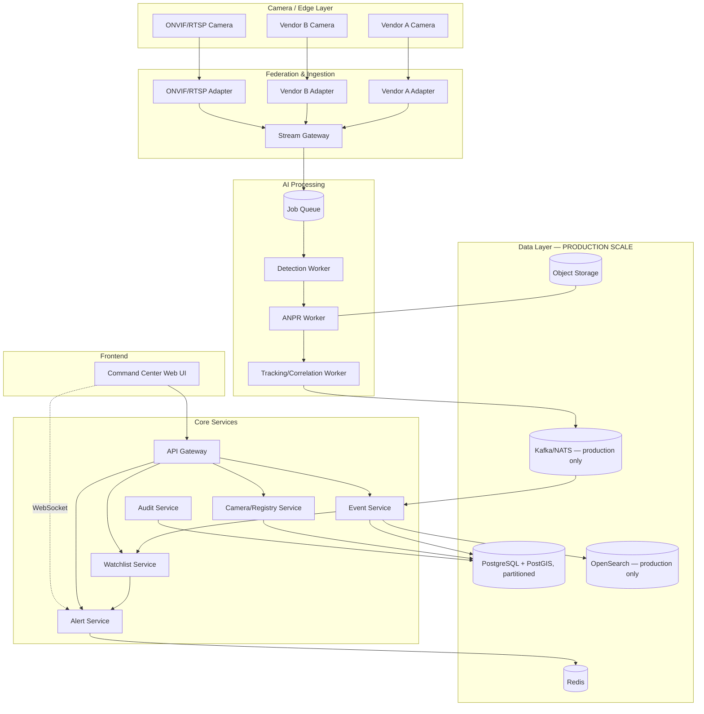
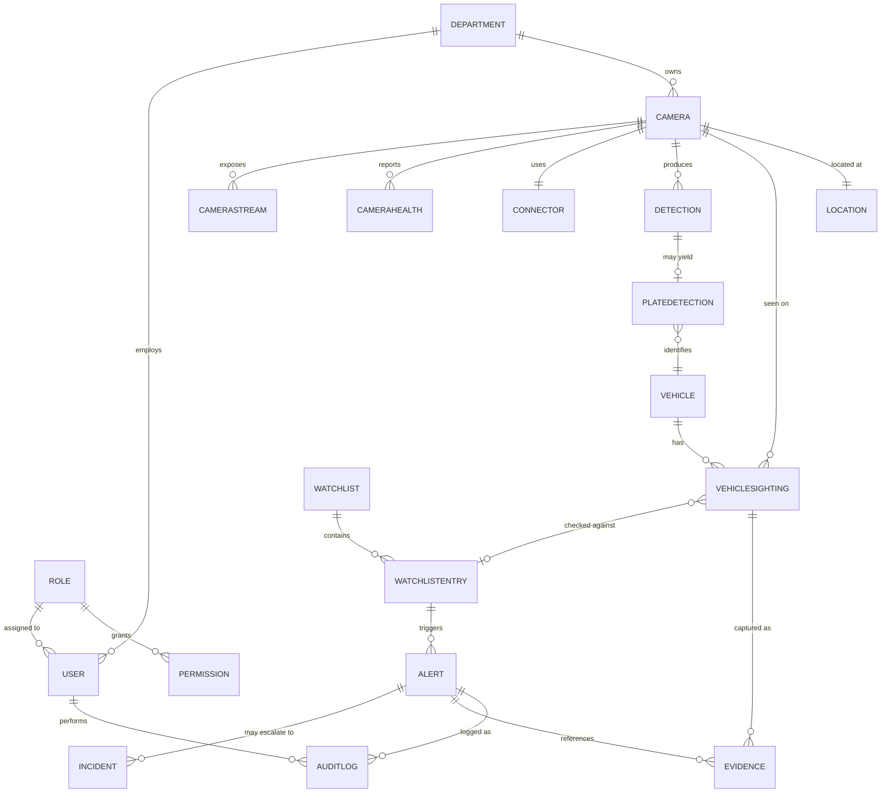
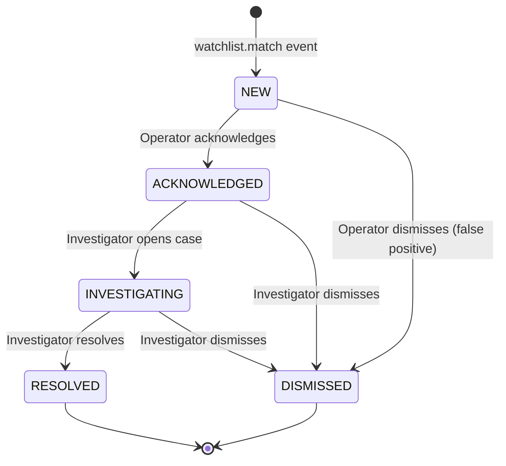
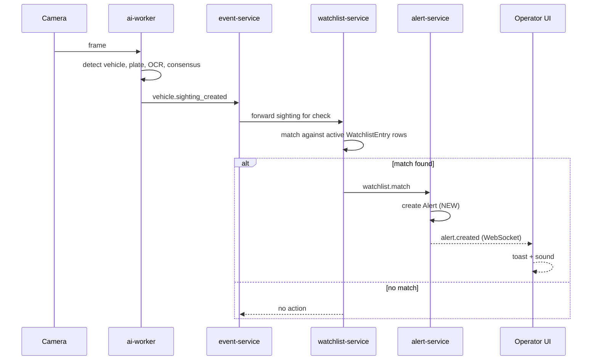
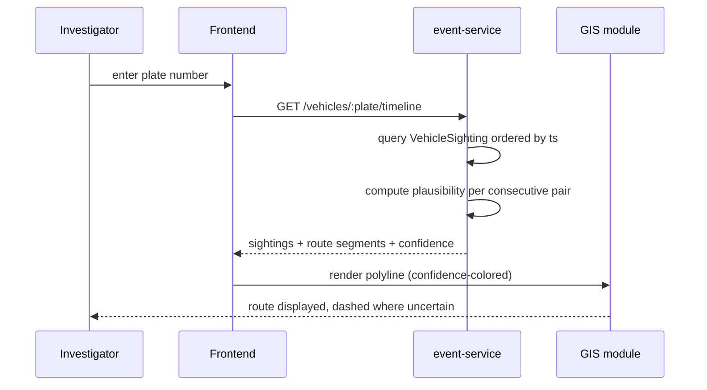
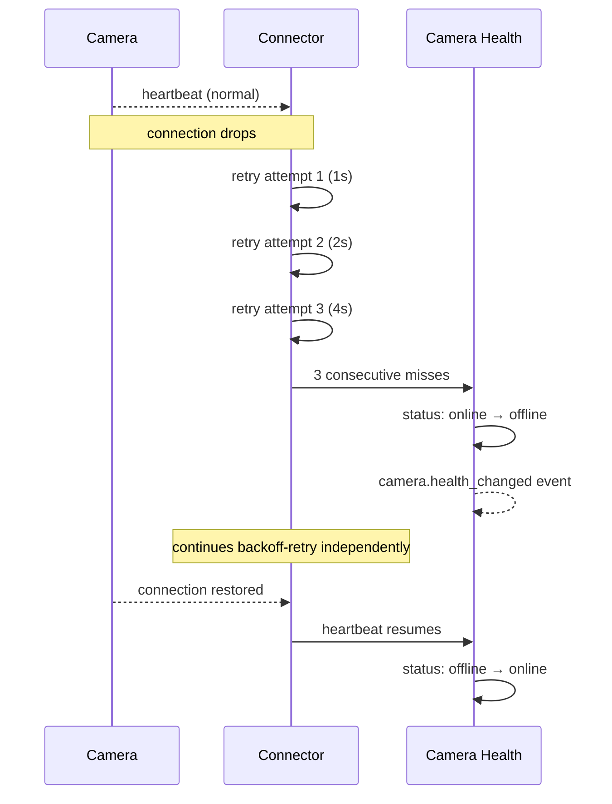
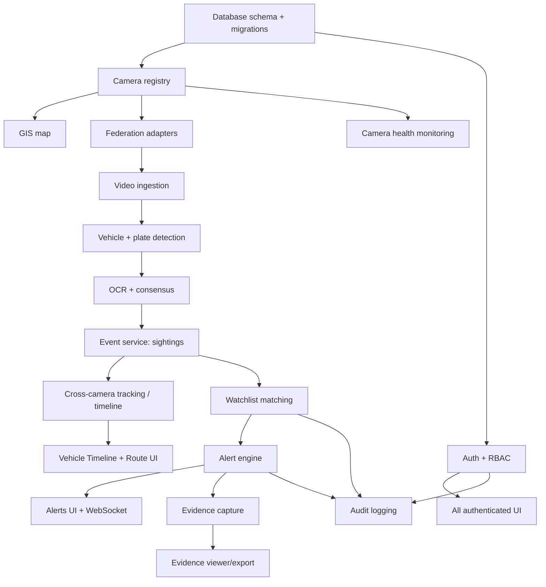

# MASTER_ARCHITECTURE_V1.1.md
## Gujarat Police Innovation Challenge 2026 — Unified CCTV Intelligence Platform
### Version 1.1 — Implementation-Ready, Design-Ready, Deployment-Ready

This document supersedes `MASTER_ARCHITECTURE.md` (v1.0). It is the single source of truth for backend, AI, database, deployment, testing, and UX-architecture work, and the input to a future `DESIGN.md`. Nothing in this document has begun implementation — this is still the freeze-review stage.

**Legend:** OFFICIAL (verified from portal/press) · INFERRED (derived, not stated verbatim) · PROPOSED (our decision) · OPTIONAL (nice-to-have) · UNKNOWN (unresolved, needs the real portal text).

---

## 1. Official Requirement Reconciliation Report

### 1.1 What changed since v1.0 — an honest answer: nothing new

I re-attempted verification for this pass: I could not fetch `sentinel.gujarat.gov.in` directly (its `robots.txt` disallows automated access — same result as v1.0), and a fresh round of web search turned up no additional indexed source with the literal problem-statement text, Model 1–4 definitions, scoring rubric, team-size rules, registration deadline, or government-feed spec. Every public article on this hackathon (a dozen+ outlets checked across both passes) repeats the same top-level facts — 80,000+ cameras, ANPR/tracking/watchlist/alerts, two-stage format, ₹37 lakh prize (one outlier post says ₹51 lakh), i-Hub/DA-IICT/NFSU partnership, DGP G.S. Malik — and consistently defers rules/eligibility/evaluation detail to the portal itself. That detail appears to genuinely live only behind participant registration. **This is not a gap I can close without you pasting or uploading the actual portal text.**

### 1.2 Reconciliation table

| # | Current architecture assumption | Official requirement found | Conflict? | Impact | Required change | Decision |
|---|---|---|---|---|---|---|
| 1 | Hybrid = Model 1 (Registry+GIS) + Model 3 (Federation) + AI layer | Only the *labels* Model 1/2/3 are confirmed via your brief; Model 4 and the official distinguishing criteria are unverified | Cannot assess — insufficient official detail | High if Model 4 turns out to fit better | None until Model 4 text is available | **Hold** — proceed with Hybrid, re-audit Section 1 the moment you share the portal text |
| 2 | ANPR, vehicle tracking, watchlist, real-time alerts are OFFICIAL required capabilities | Confirmed across every independent news source | None | — | — | **Confirmed, no change** |
| 3 | Two-stage format (Open Innovation Challenge → Finale, top 6) | Confirmed | None | — | — | **Confirmed, no change** |
| 4 | 80,000-camera scale target | Confirmed | None | — | — | **Confirmed, no change** |
| 5 | Prize pool ₹37 lakh, used for no architectural decision | ₹37 lakh in most coverage, ₹51 lakh in one promotional post | Minor factual discrepancy, zero architectural impact | None | None | **Non-blocking, cosmetic — verify for your own records only** |
| 6 | Government-feed protocol assumed RTSP/ONVIF-compatible | Not specified anywhere public | Cannot assess | High — this is the single biggest unverified assumption in the whole document | Build Section 12's placeholder contract now; do not hardcode a single protocol assumption into the adapter framework | **Proceed with protocol-agnostic adapter design (already the plan) so the risk is contained, not eliminated** |
| 7 | Team size / eligibility not encoded anywhere in the architecture | Not specified anywhere public | Cannot assess | Low — doesn't affect system architecture, affects team planning only | None to architecture | **Out of scope for this document; verify separately for team logistics** |
| 8 | Evaluation/scoring weights unknown, so Section 27 scorecard uses generic engineering dimensions | Not specified anywhere public | Cannot assess | Medium — our self-scored dimensions may not match actual judging weights | None until rubric is known | **Flag explicitly in Section 28 (Final Freeze Review) as a scoring-validity caveat** |
| 9 | Face recognition not built by default | Not specified anywhere public whether required/permitted/restricted | Cannot assess | High if it turns out to be required | None — stay on the conservative side | **Confirmed: do not build speculatively (Rule 6 of your original brief, Section 22 of this document)** |

### 1.3 Standing action item (repeated from v1.0, still open)

The single highest-leverage thing you can do before this is truly frozen: paste or upload the literal Problem Statement, Model comparison, Evaluation Criteria, and Government-Feed spec pages. Everything above stays labeled UNKNOWN or "Hold" until then — this document does **not** invent that content to look more complete than it is (Rule 15/22 from your original brief).

---

## 2. Architecture Consistency Audit (of v1.0)

Performed before writing new content, so new sections don't inherit old inconsistencies.

| # | Issue found in v1.0 | Category | Fix applied in v1.1 |
|---|---|---|---|
| 1 | Section 6.1's logical diagram shows OpenSearch and a generic "Message Broker" as baseline components, but Section 16/18 defer both to production ("do not add on day one"/"Redis Streams for PoC") | PoC/production confusion | v1.1 now carries **two** explicit diagrams — a target logical view and a separate PoC-only topology (Section 5.2) — so no single diagram is ambiguous about what's actually built for the hackathon |
| 2 | Section 6.2 lists `camera-service` and `federation-service` as separate PoC containers; Section 30.3's "minimized container list" drops `camera-service` without explanation | Missing dependency / inconsistent service boundary | v1.1 explicitly folds camera/registry logic into the `api` service as a module for the PoC (same treatment as auth), and documents camera-service as a **future** split-out (Section 5.2, Section 19) |
| 3 | Alert engine (v1.0 §15) and Watchlist engine (§14) are described as separate services, but the API list (§17) has no distinct watchlist/alert base paths beyond `/watchlist` and `/alerts` — fine, but nothing in v1.0 stated whether watchlist-service calls alert-service synchronously or via the event bus | Missing dependency | v1.1 Section 7 (Event Architecture) makes this explicit: `watchlist.match` is an event, not a direct service call, so watchlist-service and alert-service are decoupled and independently testable |
| 4 | v1.0 never defined what happens to an `Alert` once `RESOLVED` in terms of evidence retention vs. the general retention policy | Missing dependency | v1.1 Section 10 (Evidence Architecture) explicitly ties alert evidence retention to the department retention policy, not a separate undefined rule |
| 5 | v1.0 Section 16 database table used `Vehicle` and `VehicleSighting` somewhat interchangeably in prose | Inconsistent terminology | v1.1 Section 5 data model fixes this: `Vehicle` = the *entity* (a plate, if known, plus attributes); `VehicleSighting` = one *event* of that vehicle being seen; never used interchangeably again |
| 6 | v1.0 never stated whether `AuditLog` writes are synchronous (blocking the primary action) or async | Missing dependency, security-relevant | v1.1 Section 7 states audit writes are synchronous for security-sensitive actions (auth, watchlist CRUD, permission changes) and async (event-driven) for high-volume operational logging, with the split table in Section 7.2 |
| 7 | v1.0's scalability section (§23) and edge/central section (§24) both discuss GPU worker counts without cross-referencing each other | Inconsistent terminology / duplicate reasoning | v1.1 merges the numeric reasoning into one place (Section 19.3) and Section on edge/central AI now just references it |
| 8 | No v1.0 section defined what "Investigator" vs "Operator" can each *do* to an Alert's lifecycle state — RBAC table (§20) lists permissions but the Alert state machine (§15) doesn't reference roles | Missing dependency | v1.1 Section 6 (event architecture) + Section 9 (user journeys) now state which role can trigger each Alert transition |
| 9 | No explicit statement in v1.0 that simulated/demo data must be visually distinguished in the UI (only implied via Rule 7 in your original brief) | Demo/UI mismatch risk | v1.1 Section 11 (Build/Simulate/Future Matrix) makes this a hard requirement with a specific UI treatment (a persistent "SIMULATED" badge), not just an implication |

No contradictions were found regarding core technology choices (Postgres+PostGIS, Redis Streams, NestJS/Next.js/FastAPI) — those hold from v1.0 and are carried forward unchanged.

---

## 3. Product Requirements Document (PRD)

### 3.1 Problem
Gujarat's 80,000+ government/police cameras are fragmented across departments, vendors, VMS platforms, and network architectures. A sighting on one camera cannot be quickly linked to a sighting on another, which slows down exactly the kind of investigation (a stolen vehicle, a wanted plate, a suspicious pattern across locations) where minutes matter.

### 3.2 Target users / personas

| Persona | Role | Primary need |
|---|---|---|
| **Operator (Constable/Head Constable, control room)** | Watches live feeds, acknowledges alerts | Fast, unambiguous alert triage; no false-alarm fatigue |
| **Investigator (Sub-Inspector and above)** | Searches vehicles, reconstructs routes, builds cases | Trustworthy cross-camera timelines with visible confidence, exportable evidence |
| **Department Admin** | Owns a subset of cameras | Onboard/manage cameras for their department only |
| **System Auditor** | Compliance/oversight role | Full, tamper-evident audit trail across the platform |
| **Super Admin** | Platform owner | User/role/department management, system health |

### 3.3 User goals
Operators want to *not miss* a real alert and *not drown* in false ones. Investigators want to type a plate and get a trustworthy, evidence-linked trail — not a black-box answer. Admins want onboarding a new camera to take minutes, not a bespoke integration project per vendor.

### 3.4 Solution & value proposition
A registry+GIS spine, a protocol-agnostic adapter layer (proven with real adapters, not just diagrammed), and an AI pipeline (ANPR with multi-frame consensus, cross-camera correlation, watchlist matching, real-time alerting) that turns disconnected footage into an investigator-usable, confidence-scored vehicle trail — architected so the jump from a hackathon-scale demo to 80,000 cameras is a scaling exercise, not a rewrite.

### 3.5 Product boundaries

| In scope (hackathon PoC) | Out of scope (hackathon PoC) |
|---|---|
| Camera registry, GIS map | Full multi-VMS video-wall federation |
| 2–3 real protocol adapters | N-vendor adapter marketplace |
| ANPR, vehicle detection, cross-camera tracking | Face recognition (see Section 22) |
| Watchlist matching, real-time alerts | Multi-region/edge GPU pooling |
| RBAC, audit log | Full zero-trust network segmentation |
| Vehicle timeline + GIS route | Predictive/behavioral crime analytics |
| Evidence capture (frame-level) | Full video-clip evidence export pipeline |

### 3.6 MVP vs advanced vs future production
See Section 24 (Scope Control) for the authoritative MUST/SHOULD/COULD/DO-NOT-BUILD table — this PRD section states intent, Section 24 is the enforced contract.

---

## 4. Requirements Engineering Layer

### 4.1 Functional Requirements (representative set — extend per-feature during implementation)

| ID | Description | Source | Priority | User | Component |
|---|---|---|---|---|---|
| FR-001 | System shall allow onboarding a camera with required registry fields (Section 5.3 of v1.0 schema) | OFFICIAL (integration) | Must | Dept Admin | camera module |
| FR-002 | System shall reject camera onboarding with invalid GPS coordinates or duplicate RTSP endpoint | PROPOSED | Must | Dept Admin | camera module |
| FR-003 | System shall connect to a camera via at least 2 distinct adapter types (RTSP/ONVIF + one mock vendor) | OFFICIAL (integration) | Must | System | federation-service |
| FR-004 | System shall display cameras on a GIS map bounded by current viewport, clustering below a zoom threshold | PROPOSED (scalability) | Must | Operator | GIS module |
| FR-005 | System shall detect vehicles in sampled video frames | OFFICIAL (ANPR/tracking) | Must | System | ai-worker |
| FR-006 | System shall read license plates from detected vehicle crops and normalize the result | OFFICIAL (ANPR) | Must | System | ai-worker |
| FR-007 | System shall aggregate plate reads across multiple frames of one vehicle passage into a single consensus sighting | PROPOSED (robustness) | Must | System | ai-worker |
| FR-008 | System shall allow an Investigator to search a plate and receive an ordered list of sightings | OFFICIAL (tracking) | Must | Investigator | event-service |
| FR-009 | System shall render a searched vehicle's sightings as a route on the GIS map, confidence-colored | OFFICIAL (tracking) | Must | Investigator | GIS module |
| FR-010 | System shall check every new sighting against active watchlist entries | OFFICIAL (watchlist) | Must | System | watchlist-service |
| FR-011 | System shall generate an alert on a watchlist match | OFFICIAL (alerts) | Must | System | alert-service |
| FR-012 | System shall push new alerts to connected operators in real time (WebSocket) with a polling fallback | OFFICIAL (real-time alerts) | Must | Operator | alert-service |
| FR-013 | System shall allow an Operator to acknowledge/dismiss and an Investigator to investigate/resolve an alert, per the state machine in Section 6 | PROPOSED | Must | Operator/Investigator | alert-service |
| FR-014 | System shall suppress duplicate alerts from the same plate within a cooldown window | PROPOSED (robustness) | Must | System | alert-service |
| FR-015 | System shall log every watchlist match, alert transition, camera CRUD, and permission change to an immutable audit log | PROPOSED (security) | Must | System | audit module |
| FR-016 | System shall enforce role-based access control on every API endpoint | PROPOSED (security) | Must | System | api |
| FR-017 | System shall visually distinguish simulated/demo data from live data in the UI | PROPOSED (demo integrity) | Must | Operator | frontend |
| FR-018 | System shall report camera health status (online/degraded/offline) based on heartbeat | PROPOSED | Should | Operator | camera module |
| FR-019 | System shall allow export of a vehicle timeline as evidence with a chain-of-custody hash | PROPOSED | Should | Investigator | evidence module |
| FR-020 | System shall allow watchlist entry creation/expiry with source and reason recorded | OFFICIAL (watchlist) | Must | Investigator/Admin | watchlist-service |

### 4.2 Non-Functional Requirements

| ID | Description | Priority | Acceptance criteria (measurement approach) |
|---|---|---|---|
| NFR-001 | API p95 latency for read endpoints under normal PoC load | Should | Measured via load test (Section 22); target stated as a goal, not a guarantee, until measured |
| NFR-002 | Alert delivery latency from detection to operator UI | Must | Measured end-to-end in the mandatory E2E test (Section 22) |
| NFR-003 | GIS map must not degrade below usable frame rate at 80,000 simulated markers | Must | Load-tested against a synthetic 80,000-row camera table using viewport+cluster queries (Section 5's GIS design) |
| NFR-004 | All secrets excluded from source control and logs | Must | CI secret-scan gate (Section 22) |
| NFR-005 | Every sensitive read/write produces an audit record | Must | Contract test asserting audit-row creation on each sensitive endpoint |
| NFR-006 | System must degrade gracefully (not crash) on camera/database/AI-worker failure | Must | Chaos/failure test suite (Section 22), matrix in `TROUBLESHOOTING.md` |
| NFR-007 | ANPR accuracy shall be measured, not asserted, against a labeled test set before any accuracy claim is made in a demo or document | Must | Section 8's measurement protocol |
| NFR-008 | RBAC decisions enforced server-side, never trusted from client state alone | Must | Security test attempting client-side-only bypass |

*(FR/NFR lists are seeded, not exhaustive — every new feature built in implementation must be assigned an ID before merge, per Section 26's AI Coding Governance rules.)*

---

## 5. System Architecture (Revised — PoC and Target Explicitly Separated)

Audit finding #1 (Section 2) required this split. Below, the **Target Logical Architecture** shows where the system is going; the **PoC Topology** shows exactly what gets built and demoed for the hackathon. Nothing in the PoC diagram is aspirational.

### 5.1 Target logical architecture (production direction — not built for the hackathon)

### 5.2 PoC topology (this is what actually gets built and demoed)

```mermaid
flowchart TB
    subgraph Edge["Cameras (real or simulated via FFmpeg)"]
        C1[RTSP/ONVIF test camera]
        C2[Mock Vendor-A feed]
    end
    subgraph Backend["Single api service (modular monolith)"]
        AUTH[auth module]
        CAM[camera/registry module]
        FED[federation/adapter module]
    end
    subgraph Worker["ai-worker (one process, GPU-if-available/CPU-fallback)"]
        DET[detection]
        ANPR[ANPR + consensus]
        TRACK[correlation]
    end
    subgraph Svc["Independently-run services"]
        EVT[event-service]
        WL[watchlist-service]
        AL[alert-service]
    end
    subgraph Data["Data (PoC scale — no OpenSearch, no Kafka)"]
        PG[(PostgreSQL + PostGIS)]
        RD[(Redis Streams + cache)]
        MINIO[(MinIO — local object storage)]
    end
    FE[Next.js Frontend]

    C1 --> FED
    C2 --> FED
    FED --> Worker
    Worker --> RD
    RD --> EVT --> PG
    EVT --> WL --> AL
    AL --> RD
    CAM --> PG
    FE --> Backend
    FE --> EVT
    FE --> WL
    FE --> AL
    FE -. WebSocket .-> AL
    ANPR --- MINIO
```

**Why the PoC collapses camera-service and auth into `api`:** minimizing container count for a small team (audit finding #2) without losing the module boundary — `camera` and `auth` are separate NestJS modules with clean interfaces internally, so splitting them into standalone services later (production direction, Section 19) is a deployment change, not a rewrite.

### 5.3 Control flow vs data flow vs event flow

- **Control flow:** operator/investigator actions in the UI → `api` → relevant module/service → response. Synchronous, request/response.
- **Data flow:** camera → adapter → AI worker → event-service → Postgres/MinIO. One-directional, pipeline-shaped.
- **Event flow:** `sighting.created` → `watchlist.match` (or not) → `alert.created` → WebSocket push. Asynchronous, decoupled (Section 7 defines every event in this flow precisely).

---

## 6. Complete Data Architecture

### 6.1 ER diagram

### 6.2 Canonical entity model

*Security classification legend: PUBLIC (no restriction), INTERNAL (authenticated users), RESTRICTED (role-scoped), SENSITIVE (audit-on-read).*

| Entity | Purpose | Key fields (type) | PK/FK/Unique/Index | Lifecycle | Retention | Security class |
|---|---|---|---|---|---|---|
| **User** | System login identity | id(uuid), email(text), password_hash(text), role_id(uuid), department_id(uuid), mfa_enabled(bool), created_at | PK id; FK role_id→Role, department_id→Department; unique email | Created at account setup; soft-deleted on offboarding | Retained per department HR policy | RESTRICTED |
| **Role** | Named permission bundle | id(uuid), name(text) | PK id; unique name | Static, admin-managed | Indefinite | INTERNAL |
| **Permission** | Resource+action grant | id(uuid), role_id(uuid), resource(text), action(text) | PK id; FK role_id→Role; index (role_id) | Static, admin-managed | Indefinite | INTERNAL |
| **Department** | Owning org unit | id(uuid), name(text), parent_department_id(uuid, nullable) | PK id; FK self-reference | Rarely changes | Indefinite | INTERNAL |
| **Camera** | Registry record (full field list: v1.0 §7.1) | id(uuid), name, department_id, lat(numeric), long(numeric), protocol(enum), connector_type(uuid), operational_status(enum) | PK id; FK department_id, connector_type; GiST index (lat,long); index (department_id, operational_status) | Onboard → active ⇄ maintenance → decommissioned (soft-delete) | Indefinite (registry is historical record) | INTERNAL |
| **CameraStream** | A stream exposed by a camera | id(uuid), camera_id(uuid), codec, resolution, fps, url_or_handle | PK id; FK camera_id→Camera | Tied to camera lifecycle | Same as Camera | INTERNAL |
| **CameraHealth** | Rolling health status | camera_id(uuid), last_heartbeat(timestamptz), fps_actual, packet_loss, status(enum) | PK camera_id; FK camera_id→Camera | Upserted every heartbeat interval | 30 days rolling (PROPOSED), then aggregated | INTERNAL |
| **Connector** | Adapter configuration | id(uuid), adapter_type(text), config_ref(text — secrets-manager reference, never inline) | PK id | Admin-managed | Indefinite | RESTRICTED (contains credential references) |
| **Detection** | Raw AI detection (vehicle/person bbox) | id(uuid), camera_id, ts, type(enum), bbox(jsonb), confidence(numeric) | PK id; FK camera_id; index (camera_id, ts) | Created by ai-worker; immutable | Per department retention policy (PROPOSED default 90 days for raw detections) | INTERNAL |
| **PlateDetection** | One frame's OCR read (pre-consensus) | id(uuid), detection_id, raw_text, confidence, frame_ref | PK id; FK detection_id→Detection | Immutable, feeds consensus | Same as parent Detection | INTERNAL |
| **Vehicle** | Vehicle entity (plate-anchored identity) | plate_normalized(text, PK-ish), first_seen, last_seen, attributes(jsonb) | PK plate_normalized; index (last_seen) | Upserted on first sighting, updated on each new sighting | Indefinite (investigative value) | RESTRICTED |
| **VehicleSighting** | One consensus sighting event | id(uuid), plate_normalized(FK), camera_id(FK), ts, confidence, consensus_of(int), frame_ref | PK id; FK plate_normalized→Vehicle, camera_id→Camera; index (plate_normalized, ts); index (camera_id, ts) | Created post-consensus (Section 8); immutable | Per department policy (PROPOSED default 1 year), partitioned by month at production scale | RESTRICTED |
| **Watchlist** | A named list (e.g., "Stolen Vehicles — Ahmedabad") | id(uuid), name, department_id, owner | PK id; FK department_id | Admin-managed | Indefinite | RESTRICTED |
| **WatchlistEntry** | One flagged plate | id(uuid), watchlist_id(FK), plate_normalized, category, reason, priority, added_by, expires_at, active(bool) | PK id; FK watchlist_id→Watchlist; index (plate_normalized, active) | Created → active → expired/removed | Retained past expiry for audit (soft flag `active=false`, not deleted) | SENSITIVE |
| **Alert** | A watchlist-match event surfaced to operators | id(uuid), source_sighting_id(FK), watchlist_entry_id(FK), severity, status(enum), ts | PK id; FK source_sighting_id→VehicleSighting, watchlist_entry_id→WatchlistEntry; index (status, ts) | State machine per Section 6.3 below | Same as linked sighting | SENSITIVE |
| **Incident** | Optional escalation of one or more alerts into a formal case | id(uuid), title, opened_by, status, related_alert_ids(array) | PK id | Investigator-opened; closed on resolution | Per case-management policy (production feature — PoC has a minimal version) | SENSITIVE |
| **Evidence** | Immutable artifact tied to a sighting/alert | id(uuid), source_type(enum: sighting/alert), source_id(uuid), storage_ref, hash(text), captured_at | PK id; FK source_id (polymorphic — validated at application layer, not DB-enforced FK, documented explicitly as a known trade-off) | Write-once at capture time | Per department retention policy | SENSITIVE |
| **AuditLog** | Immutable action record | id(uuid), actor_id(FK User), action, resource, before(jsonb), after(jsonb), ts, correlation_id | PK id; FK actor_id→User; index (resource, ts) | Append-only, never updated/deleted | Indefinite (compliance requirement) | SENSITIVE |
| **Location** | Denormalized address/zone/district for a Camera | camera_id(FK, PK), address, zone, district | PK camera_id; FK camera_id→Camera | Tied to Camera | Same as Camera | INTERNAL |

### 6.3 Alert entity lifecycle (state machine, cross-referenced with RBAC)

Every transition above writes an `AuditLog` row with `actor_id` — this closes audit finding #8 from Section 2.

### 6.4 Indexing, partitioning, retention, migration

- **Indexing:** covered per-entity above; the two highest-value indexes for demo-visible performance are the GiST spatial index on `Camera(lat,long)` and the composite `VehicleSighting(plate_normalized, ts)` index that makes the timeline query fast even before any partitioning exists.
- **Partitioning:** `VehicleSighting` and `Detection` are the only tables expected to need partitioning (by month) — deferred until real volume requires it (PoC volume doesn't), per the "don't add infra before it's needed" principle carried from v1.0.
- **Retention:** every department-scoped table (`Camera`, `VehicleSighting`, `WatchlistEntry`, `Evidence`) resolves retention through a `department.retention_policy_id` rather than a hardcoded global constant, so retention is configurable without a schema change.
- **Migration strategy:** all schema changes go through versioned migrations (PROPOSED: Prisma/TypeORM migrations, whichever the NestJS project standardizes on) — no manual `ALTER TABLE` against a running environment, including the hackathon demo environment, to keep the demo and dev environments reproducible from the same migration history.

---

## 7. Event Architecture

### 7.1 Canonical domain events

| Event | Producer | Consumer(s) | Payload (key fields) | Ordering | Idempotency | Retry | Dead-letter | Audit? |
|---|---|---|---|---|---|---|---|---|
| `camera.created` | camera module | event-service, audit | camera_id, department_id | Not required | Keyed on camera_id | 3x backoff | Yes, log+alert on DLQ | Yes (sync) |
| `camera.updated` | camera module | event-service, audit | camera_id, diff | Not required | Keyed on camera_id+version | 3x backoff | Yes | Yes (sync) |
| `camera.health_changed` | health monitor | camera module, alert-service | camera_id, old_status, new_status | Not required | Keyed on camera_id+ts | 3x backoff | Yes | No (operational, async) |
| `stream.connected` / `stream.disconnected` | federation adapter | camera module | camera_id, stream_id | Not required | Keyed on stream_id+ts | 3x backoff | Yes | No |
| `detection.created` | ai-worker | ai-worker (internal pipeline stage) | detection_id, camera_id, bbox, confidence | Per-camera ordering preferred, not strict | Keyed on detection_id | 5x backoff (high volume) | Yes, sampled logging only (volume) | No |
| `plate.detected` | ai-worker | ai-worker (consensus stage) | plate_detection_id, detection_id, raw_text, confidence | Per-track ordering required | Keyed on plate_detection_id | 5x backoff | Yes | No |
| `vehicle.sighting_created` | ai-worker (post-consensus) | event-service, watchlist-service | sighting_id, plate_normalized, camera_id, ts, confidence | Not required across cameras; required within one track | Keyed on sighting_id | 3x backoff | Yes | Yes (async batch) |
| `watchlist.match` | watchlist-service | alert-service, audit | sighting_id, watchlist_entry_id, match_type(exact/fuzzy), score | Not required | Keyed on sighting_id+watchlist_entry_id | 3x backoff | Yes | **Yes (sync)** — security-sensitive |
| `alert.created` | alert-service | frontend (WS), audit | alert_id, severity, sighting_id | Not required | Keyed on alert_id | 3x backoff | Yes | Yes (sync) |
| `alert.acknowledged` / `alert.resolved` / `alert.dismissed` | alert-service (on user action) | audit, frontend | alert_id, actor_id, new_status | Required per-alert | Keyed on alert_id+status | 3x backoff | Yes | **Yes (sync)** |
| `evidence.created` | evidence module | audit | evidence_id, source_id, hash | Not required | Keyed on evidence_id | 3x backoff | Yes | **Yes (sync)** |

### 7.2 Sync vs async audit-write policy (resolves audit finding #6)

| Category | Examples | Write mode | Why |
|---|---|---|---|
| Security-sensitive actions | auth events, watchlist CRUD, permission changes, alert lifecycle transitions, evidence creation | **Synchronous** — the action fails if the audit write fails | These are exactly the actions that must never silently go unlogged |
| High-volume operational events | detections, plate reads, health pings | **Asynchronous** (event-driven, batched) | Blocking the AI pipeline on a per-frame audit write would tank throughput for no proportionate benefit — the sighting itself is durably stored, which is the record that matters |

### 7.3 Schema versioning
Every event payload carries a `schema_version` integer field from day one (even at v1) so a consumer can reject or branch on an unexpected version rather than silently misparsing a future field change — cheap now, expensive to retrofit later.

---

## 8. API Contract (Expanded)

### 8.1 Cross-cutting conventions
- **Versioning:** `/api/v1/...` prefix on every route.
- **Auth:** JWT bearer token, 15-minute access token + refresh token rotation.
- **Errors:** `{ "error_code": "string", "message": "string", "request_id": "uuid" }`, consistent HTTP status mapping (400 validation, 401 unauth, 403 forbidden, 404 not found, 409 conflict, 429 rate-limited, 500 unexpected).
- **Pagination:** cursor-based (`?cursor=&limit=`) on every list endpoint — offset pagination is explicitly avoided given `VehicleSighting` will be a high-growth table.
- **Correlation IDs:** every request gets an `X-Request-Id`, propagated through to any emitted event and audit row, so one action can be traced end-to-end across services.
- **Rate limiting:** per-user token bucket, tighter limits on write endpoints and on `/vehicles/:plate/timeline` specifically (the most expensive read).
- **Idempotency:** all `POST` endpoints that create a resource accept an optional `Idempotency-Key` header; watchlist/alert-affecting endpoints require it.

### 8.2 Representative endpoint detail (full spec lives in `docs/API.md`)

| Method & Path | Auth | AuthZ (min role) | Request | Response | Notable errors |
|---|---|---|---|---|---|
| `POST /api/v1/cameras` | Required | Department Admin | Camera payload (Section 6.2 fields) | 201 + Camera | 409 duplicate RTSP endpoint/near-duplicate GPS |
| `GET /api/v1/cameras?bbox=&status=&department=&cursor=` | Required | Viewer+ | — | 200 + Camera[] + next_cursor | 400 invalid bbox |
| `GET /api/v1/vehicles/:plate/timeline` | Required | Investigator+ | — | 200 + ordered sightings + route segments w/ confidence | 404 no sightings found (not an error state, just empty) |
| `POST /api/v1/watchlist` | Required | Investigator/Admin | plate, category, reason, priority, expires_at | 201 + WatchlistEntry | 400 invalid plate format |
| `PATCH /api/v1/alerts/:id` | Required | Operator (ack/dismiss) / Investigator (investigate/resolve) | `{status}` | 200 + Alert | 409 invalid state transition (enforced server-side against Section 6.3's state machine) |
| `WS /ws/alerts` | Required (token on connect) | Operator+ | — | Stream of `alert.created`/`alert.updated` | Connection closes with reason code on auth expiry, client should reconnect with refreshed token |

---

## 9. AI Architecture and Measurement

**Governing rule (per your brief): do not invent performance numbers.** Every accuracy/latency figure below is a **measurement protocol**, not a claimed result, until an actual test run produces one.

| Capability | Model (PROPOSED) | Input | Output | Preprocess | Postprocess | Confidence/threshold | Latency target | Hardware | Test dataset | Acceptance criteria |
|---|---|---|---|---|---|---|---|---|---|---|
| Vehicle detection | YOLO-family (pretrained, fine-tune if time permits) | Sampled frame | bbox + class + confidence | Resize/normalize | NMS | Configurable min-confidence (start 0.5, tune from measured PR curve) | <150ms/frame target (unverified until benchmarked) | GPU preferred, CPU fallback (slower, documented) | Synthetic/public vehicle-detection set + our own captured demo footage | ≥ measured baseline on held-out set; number reported, not assumed |
| Plate detection | Lightweight plate-localization model | Vehicle crop | Plate bbox | Crop from vehicle bbox | — | Min-confidence gate before OCR attempt | Sub-frame-budget | Same as above | Labeled plate-crop set | Same protocol — measured, reported |
| OCR | Open-source OCR engine (PaddleOCR-class) | Plate crop | Character string + per-char confidence | Deskew, contrast normalize, denoise | Normalize to state-code format | Per-character + aggregate confidence | — | CPU acceptable for OCR stage | Labeled Indian-plate crop set (synthetic + captured) | Character-level accuracy measured pre- and post-consensus, both reported |
| Multi-frame consensus | Rule-based majority vote (Section 9.1 below), not a model | N plate reads for one track | Single consensus plate + aggregate confidence | — | — | N=5–8 frames (PROPOSED, tunable) | — | — | Same test set, replayed as synthetic multi-frame tracks | Consensus accuracy vs single-frame accuracy — the delta is the actual metric that matters, and must be reported, not assumed positive |
| Cross-camera correlation | Rule-based (plate match + geographic/temporal plausibility, Section 10) | Ordered sightings for one plate | Route segments + confidence | — | — | Plausibility thresholds (Section 10) | — | — | Synthetic multi-camera scenario with known ground-truth route | % of correct route reconstruction on the synthetic set |

### 9.1 Multi-frame consensus (carried forward from v1.0, unchanged)
Character-level majority vote across up to N frames of one vehicle track, weighted by per-frame confidence; only the consensus result is written as the canonical `VehicleSighting`. Individual frame reads persist in `PlateDetection` (Section 6.2) as evidence, not as separate sighting events.

### 9.2 False positive / false negative risk, explicitly

| Failure | Consequence | Mitigation |
|---|---|---|
| False positive plate match (misread plate happens to match a watchlist entry) | Wastes operator time, risks unwarranted suspicion of an innocent vehicle | Confidence + match-type (exact vs fuzzy) always shown; fuzzy matches visually distinct; every match audit-logged with the score used, so it's reviewable after the fact |
| False negative (real watchlisted vehicle not read correctly) | Missed lead | Multi-frame consensus reduces this vs single-frame; low-confidence sightings still stored (not discarded) so a human can review borderline cases |

---

## 10. Cross-Camera Identity Model

| Approach | What it is | PoC or production? | Confidence contribution |
|---|---|---|---|
| **Plate-based identity** (PRIMARY) | The normalized plate string is the vehicle's identity key | **PoC — this is what's actually built** | Direct — OCR consensus confidence propagates to the sighting |
| Vehicle-attribute identity (color/type/make) | Secondary corroborating signal, not a standalone identity | **OPTIONAL, time-permitting** — used only to raise/lower confidence on an already plate-matched pair, never to create an identity link on its own | Modifier, not primary signal |
| Visual re-identification (matching a vehicle's visual appearance across cameras without a readable plate) | Deep-learning re-ID embeddings | **Explicitly NOT built** — no official requirement justifies this complexity (per your Rule: don't overengineer re-ID without official basis) | N/A |
| Temporal correlation | Time-window plausibility between sightings | **PoC — implemented** (Section 13 of v1.0, carried forward) | Part of the route-segment confidence score |
| Geographic correlation | Distance/speed plausibility between camera locations | **PoC — implemented** | Part of the route-segment confidence score |

**Confidence model:** `route_segment_confidence = min(sighting_A.confidence, sighting_B.confidence, plausibility_score)` — unchanged from v1.0, now explicitly cross-referenced here as the canonical definition (single source, not duplicated with drift risk).

**Production evolution:** visual re-ID becomes worth considering only if the official requirements (once verified) explicitly call for tracking a vehicle across cameras *without* a readable plate — a real but materially harder problem that deserves its own design pass, not a speculative build now.

---

## 11. Evidence Architecture

### 11.1 What counts as evidence
An `Evidence` record (Section 6.2) is a single immutable artifact — a frame image at minimum for the PoC; a short clip is a documented **production** extension, not built now (video-clip storage/streaming adds meaningful infrastructure the PoC timeline doesn't justify, and it's not required to prove the core claims).

### 11.2 Evidence lifecycle
Capture (at consensus sighting or watchlist match time) → hash computed (SHA-256) and stored alongside the artifact → write-once storage (object storage with versioning/lock, or, at PoC scale, a MinIO bucket with application-enforced no-overwrite) → linked to its source `VehicleSighting`/`Alert` → retained per the **same department retention policy** as its parent record (resolves audit finding #4 — no separate undefined rule) → export produces a package containing the artifact, its hash, and the chain-of-custody metadata (who captured it, when, from which camera, under which correlation ID).

### 11.3 Chain of custody
Every access to an `Evidence` record (view or export) is itself audit-logged (SENSITIVE classification, Section 6.2) — this is what makes an exported evidence package defensible, not just the hash.

### 11.4 Integrity verification
On export, the hash is recomputed from stored bytes and compared to the originally recorded hash; a mismatch blocks export and raises a security alert rather than silently exporting a possibly-altered artifact.

---

## 12. Government-Feed Integration Contract

**Status: placeholder — UNKNOWN pending real spec.** This section exists so the moment the real feed details arrive, there's a pre-built slot to fill rather than a scramble.

| Field | Value | Status |
|---|---|---|
| Protocol | ? | UNKNOWN |
| VMS platform | ? | UNKNOWN |
| Authentication method | ? | UNKNOWN |
| Endpoint / access mechanism | ? | UNKNOWN |
| Codec | ? | UNKNOWN |
| Resolution | ? | UNKNOWN |
| FPS | ? | UNKNOWN |
| Network path (VPN? whitelisted IP? on-site only?) | ? | UNKNOWN |
| Expected latency | ? | UNKNOWN |
| Data-handling permissions (can frames leave the network? be stored?) | ? | UNKNOWN |
| AI-processing constraints (on-prem only? specific hardware mandated?) | ? | UNKNOWN |
| Evidence-handling constraints | ? | UNKNOWN |

### 12.1 Validation checklist (must pass before claiming "government-feed compatible")
1. Adapter successfully authenticates against the real feed.
2. Adapter receives a stable stream for a sustained test window (PROPOSED: 30+ minutes without manual intervention).
3. Frame quality is sufficient for the detection/ANPR pipeline to produce at least one successful consensus sighting.
4. Full E2E test (Section 22) run once against the real feed, not just a simulated one.
5. Data-handling constraints (if any) are confirmed compatible with our storage/retention design — or the design is adjusted before demo day, not during it.

**Rule carried forward from your original brief:** we do not claim government-feed compatibility, tested or otherwise, until every item above is actually checked against the real feed.

---

## 13. End-to-End User Journeys

Full prose workflow docs for all 21 live in `docs/USER_JOURNEYS.md` during implementation; here they're captured completely but compactly — every required field is present, condensed into one row per journey so the full set stays scannable as a single reference table. Sequence diagrams follow for the three most demo-critical, multi-service journeys.

| # | Journey | Trigger | Actor | Steps (condensed) | Services involved | DB changes | Events emitted | UI changes | Success | Failure states / fallback | Audit |
|---|---|---|---|---|---|---|---|---|---|---|---|
| A | Login | User submits credentials | Any user | Validate credentials → issue JWT+refresh → load role/permissions | api (auth module) | User.last_login updated | — (auth is sync, not event-driven) | Redirect to role-appropriate dashboard | Token issued, dashboard loads | Bad credentials → 401, generic message (no user-enumeration leak); lockout after N attempts (PROPOSED) | Yes (sync — login attempts, success and failure) |
| B | Camera onboarding | Admin submits camera form or bulk CSV | Dept Admin | Validate fields → dedup check → persist → attempt adapter handshake | camera module, federation module | New Camera, CameraStream rows | `camera.created` | New camera appears in registry + map | Camera onboarded, handshake succeeds | Dup detected → flagged for review, not silently merged; handshake fails → camera saved as `status=pending`, retried in background | Yes (sync) |
| C | Camera health monitoring | Scheduled heartbeat | System (background job) | Poll/receive heartbeat → compute status → upsert CameraHealth | camera module | CameraHealth upsert | `camera.health_changed` (on transition only) | Health badge updates on registry/map | Status accurately reflects reality | Missed heartbeats → degraded → offline per thresholds (Section 25 of v1.0) | No (operational, async) |
| D | Live monitoring | Operator opens Live Monitoring page | Operator | Fetch connected streams → render grid | camera module, federation module | None (read-only) | — | Live grid renders | Feeds visible | Stream unavailable → tile shows offline state, not a frozen frame | No |
| E | ANPR detection | New frame available from pipeline | System | Detect vehicle → crop → detect plate → OCR → normalize → consensus check | ai-worker | PlateDetection rows (per-frame); VehicleSighting row (on consensus) | `detection.created`, `plate.detected`, `vehicle.sighting_created` | New sighting appears in live feed / timeline if plate is being watched | Consensus sighting recorded with confidence | Low-confidence read → stored but flagged `low_confidence`, not discarded | Async (high-volume) |
| F | Vehicle search | Investigator enters a plate | Investigator | Query `VehicleSighting` by plate → order by ts | event-service | None (read-only) | — | Timeline list renders | Sightings returned, ordered | No sightings → empty state with clear messaging, not an error | Yes (sync — sensitive read) |
| G | Cross-camera vehicle tracking | Same as F, extended | Investigator | As F, plus plausibility scoring between consecutive sightings | event-service | None (read-only, plausibility computed on read or cached) | — | Timeline shows confidence per hop | Route segments scored | Implausible jump → segment flagged, not silently connected | Yes (sync) |
| H | GIS route reconstruction | Investigator views a searched vehicle on the map | Investigator | Render ordered sighting coordinates as a polyline, confidence-colored | GIS module | None (read-only) | — | Route renders on map | Route visible with confidence coloring | Gap between sightings → dashed segment, not a false solid line | No (covered by F/G's audit) |
| I | Watchlist creation | Investigator/Admin adds an entry | Investigator/Admin | Validate plate format → persist → set expiry | watchlist-service | New WatchlistEntry | `watchlist.entry_created` (extends Section 7 list) | Entry appears in Watchlist view | Entry active | Invalid plate format → 400 with clear message | Yes (sync — SENSITIVE) |
| J | Watchlist match | New sighting created | System | Check sighting's plate against active entries | watchlist-service | None (match is computed, not stored separately from the Alert it produces) | `watchlist.match` | — (internal) | Match correctly identified | No match → no action, not logged as a "miss" (would be excessive) | Yes (sync — SENSITIVE) |
| K | Alert generation | `watchlist.match` event | System | Create Alert in `NEW` state → push via WebSocket | alert-service | New Alert row | `alert.created` | Alert appears in Operator's Alerts view + toast/sound | Alert visible within latency target | WebSocket down → operator still sees it via polling fallback | Yes (sync) |
| L | Alert investigation | Investigator opens an alert | Investigator | Transition `ACKNOWLEDGED`→`INVESTIGATING`; view linked sighting/evidence | alert-service | Alert.status updated | `alert.updated` | Alert detail view, linked evidence panel | Investigator has full context | Missing evidence → panel states so explicitly, doesn't fail silently | Yes (sync) |
| M | Alert resolution | Investigator closes the case | Investigator | Transition to `RESOLVED` or `DISMISSED` with a reason | alert-service | Alert.status updated | `alert.resolved`/`alert.dismissed` | Alert moves to resolved list | Alert closed with reason recorded | Invalid transition attempt → 409, state machine enforced server-side | Yes (sync) |
| N | Evidence viewing | User opens evidence panel on a sighting/alert | Investigator/Auditor | Fetch Evidence record → verify hash → render | evidence module | None (read-only) | — | Evidence image + metadata shown | Evidence displayed, integrity confirmed | Hash mismatch → blocked, security alert raised (Section 11.4) | Yes (sync — SENSITIVE read) |
| O | Evidence export | User requests export | Investigator | Recompute hash → package artifact + chain-of-custody metadata | evidence module | None (export is a read+package operation) | — | Download/export initiated | Package produced | Hash mismatch → export blocked (11.4) | Yes (sync) |
| P | Camera failure | Heartbeat lost | System | Backoff-retry → eventually mark offline | camera module | CameraHealth.status updated | `camera.health_changed` | Offline badge appears | Failure detected and surfaced within N intervals | Camera never recovers → stays offline, visible in health dashboard, not silently hidden | No |
| Q | AI failure | ai-worker crashes or queue backs up | System | Health check fails → queue depth alarm → (production) autoscale / (PoC) alert to team | ai-worker, ops monitoring | None directly | Internal ops alert, not a domain event | Dashboard shows "processing delayed" | Detected quickly, no silent data loss | Queue overflow → PoC mitigation is graceful sampling-rate reduction before frame drop (Section 27 of v1.0) | No (ops-level, not audit-level) |
| R | Government feed integration | Feed credentials/spec provided | Dept Admin / Dev | Run Section 12.1 validation checklist | federation module | New Connector/Camera rows once validated | `camera.created` on success | New government cameras appear once validated | All 5 checklist items pass | Any checklist item fails → feed marked `not integration-ready`, not silently assumed working | Yes (sync — onboarding is audited) |
| S | Operator workflow (composite) | Shift start | Operator | Login → Live Monitoring → respond to Alerts as they arrive | api, alert-service | Per underlying journeys (A, D, K, L) | Per underlying journeys | Normal operational flow | Shift completed with alerts triaged | Covered by underlying journeys' failure states | Per underlying journeys |
| T | Investigator workflow (composite) | Case assigned | Investigator | Login → Vehicle Search → Timeline/Route → Evidence → Resolve | api, event-service, evidence module, alert-service | Per underlying journeys (A, F, G, H, N, M) | Per underlying journeys | Normal investigative flow | Case resolved with evidence attached | Covered by underlying journeys | Per underlying journeys |
| U | Administrator workflow (composite) | Ongoing | Super/Dept Admin | Login → manage Users/Roles/Departments/Cameras/Watchlists | api (auth, camera, watchlist modules) | Per underlying journeys | Per underlying journeys | Admin panels | System correctly configured | Covered by underlying journeys | Per underlying journeys |

### 13.1 Sequence diagram — Journey E→J→K (detection through alert, the demo's spine)

### 13.2 Sequence diagram — Journey F→G→H (investigator vehicle search)

### 13.3 Sequence diagram — Journey P (camera failure and recovery)

---

## 14. UI/UX Architecture

This is the information architecture that becomes `DESIGN.md` and then Figma — no visual mockups yet, per your instruction, just structure, data, and behavior per screen.

### 14.1 Cross-cutting UI-state policy (applies to every screen below unless a screen explicitly overrides it)

| State | Policy |
|---|---|
| **Loading** | Skeleton placeholders matching the eventual layout shape — never a blank screen, never a generic spinner for anything that takes >1s |
| **Empty** | Always explains *why* it's empty and what action (if any) resolves it — never a bare "no data" |
| **Error** | Human-readable message + `request_id` shown (for support/debugging), never a raw stack trace or raw API error body |
| **Offline** | A persistent top-of-app banner when the WebSocket/API is unreachable — live-monitoring and alert screens explicitly downgrade to "last known state, may be stale" rather than pretending to be live |
| **Responsive** | Command-center screens (Live Monitoring, GIS Map) are desktop/large-tablet-first — genuinely mobile-first isn't a realistic operational context for a control room, and design effort isn't spent pretending otherwise; Admin/Alerts/Vehicle-Search screens are fully responsive since those are plausibly used on the move |
| **Accessibility** | Color is never the only signal (confidence levels, health states, alert severity all pair color with an icon/label); full keyboard navigation on all form and table interactions; WCAG AA contrast minimum |
| **Simulated-data indicator** | Any screen showing seeded/demo data during the hackathon carries a persistent, unmissable "SIMULATED DATA" badge — resolves audit finding #9, this is a hard requirement, not a style choice |

### 14.2 Screens

| Screen | Purpose | Primary user | Key components | Key API deps | Permissions | Demo importance |
|---|---|---|---|---|---|---|
| Login | Authenticate | All | Form, error state | `POST /auth/login` | Public | Low (necessary, not a highlight) |
| Dashboard | At-a-glance KPIs | All (role-scoped widgets) | KPI cards, recent alerts | `/analytics/summary` | Role-scoped widgets | Medium |
| Command Center / Live Monitoring | Watch connected feeds | Operator | Video-tile grid, offline badges | camera/federation modules | Operator+ | **High** |
| GIS Camera Map | Spatial camera overview | Operator/Investigator | MapLibre map, viewport-bounded fetch, clustering | `/cameras?bbox=` | Viewer+ | **High** |
| Camera Registry | List/manage cameras | Dept Admin | Table, filters, onboarding CTA | `/cameras` | Dept Admin (own dept), Super Admin (all) | Medium |
| Camera Detail | Single camera deep-dive | Dept Admin/Operator | Metadata panel, live preview, health history | `/cameras/:id` | Viewer+ (edit: Dept Admin) | Medium |
| Camera Health | Fleet health overview | Operator/Admin | Status board, uptime chart | `/cameras` health fields | Viewer+ | Medium |
| Vehicle Search | Enter a plate | Investigator | Search bar, recent searches | — | Investigator+ | **High** |
| Vehicle Timeline | Ordered sightings for a plate | Investigator | Table/list, confidence badges, evidence links | `/vehicles/:plate/timeline` | Investigator+ | **High** |
| Vehicle Route (GIS) | Spatial route reconstruction | Investigator | Map + polyline, confidence color legend | Same as above | Investigator+ | **High** |
| Watchlist | Manage flagged plates | Investigator/Admin | Table, add/expire form | `/watchlist` | Investigator+ (create), Viewer (view) | Medium |
| Alerts | Live alert feed + triage | Operator/Investigator | List, severity badges, lifecycle actions | `/alerts`, `WS /ws/alerts` | Operator+ | **High** |
| Incident / Investigation | Case view tying alerts+evidence together | Investigator | Timeline of linked alerts, notes, status | `/incidents` (PoC-minimal) | Investigator+ | Medium |
| Evidence Viewer | View/verify a single artifact | Investigator/Auditor | Image viewer, hash/integrity indicator, metadata | `/evidence/:id` | Investigator+ (Auditor: read-only) | Medium |
| Analytics | Aggregate KPIs, trends | Admin | Charts (Section 9's measured metrics, not invented ones) | `/analytics/*` | Admin+ | Low–Medium |
| Administration — Users | Manage accounts | Super/Dept Admin | Table, role assignment | `/users` | Admin+ | Low |
| Administration — Roles/Permissions | Manage RBAC | Super Admin | Matrix editor | `/roles` | Super Admin | Low |
| Administration — Departments | Manage org units | Super Admin | Tree/table | `/departments` | Super Admin | Low |
| Settings | Personal/system prefs | All / Admin | Forms | `/settings` | Role-scoped | Low |
| Audit Log Viewer | Compliance review | System Auditor | Filterable table, read-only | `/audit` | Auditor+ | Low (but judge-relevant if security is probed) |

*(Full per-field breakdown — layout, interactions, exact data bindings — for the **High**-demo-importance screens lives in `DESIGN.md`, which this section feeds directly; Low/Medium screens follow the same cross-cutting policy above without needing bespoke documentation before implementation.)*

---

## 15. Design System Requirements

### 15.1 Principles
Operational clarity over visual flourish (carried from v1.0's frontend mandate); every design decision is justified by an operator/investigator workflow need, not decoration. Confidence and status are always legible at a glance — this is a system where a misread badge has real consequences.

### 15.2 Core tokens and patterns

| Area | Direction (PROPOSED — refined in DESIGN.md) |
|---|---|
| Typography | A highly legible UI sans-serif at operational sizes (control-room screens are often viewed from a slight distance); numeric/plate text in a monospace-leaning face so characters like `0/O`, `1/I` are unambiguous — genuinely functional here, not stylistic |
| Spacing/grid | Consistent 8px-based spacing scale; dense but not cramped tables for the high-volume screens (Vehicle Timeline, Alerts) |
| Color | Status/severity colors reserved exclusively for status/severity (never reused decoratively elsewhere), always paired with icon/label per the accessibility policy (14.1) |
| Navigation | Persistent left rail for module switching (Dashboard/Live/Map/Vehicles/Watchlist/Alerts/Admin), consistent across all screens |
| Cards | Used for KPI summaries and camera tiles; not overused for content that's better tabular |
| Tables | The primary content pattern for Vehicle Timeline, Watchlist, Alerts, Registry, Audit — sortable, filterable, cursor-paginated matching the API contract (Section 8.1) |
| Maps | MapLibre GL, consistent marker/cluster/route styling across GIS Camera Map and Vehicle Route screens |
| Charts | Used only on Analytics, only for measured metrics (Section 9) — never a placeholder chart with invented numbers |
| Status indicators / badges | One consistent badge component reused for camera health, alert severity, sighting confidence, and the SIMULATED-DATA flag |
| Dialogs/drawers | Drawers for detail-without-navigation-away (e.g., Camera Detail from the Registry table); modals reserved for confirmations (e.g., decommissioning a camera) |
| Dark/light mode | **PROPOSED: dark-first.** A control-room/command-center context is plausibly low-light and long-session; dark-first reduces eye strain and matches the operational context better than a marketing-site default of light-first — light mode supported, not primary |
| Breakpoints | Desktop-first for command-center screens (14.1); standard responsive breakpoints for Admin/Alerts/Vehicle-Search |
| Accessibility | WCAG AA baseline, keyboard nav, color-plus-icon status signaling (14.1) |

### 15.3 Documentation chain
`MASTER_ARCHITECTURE_V1.1.md` (this document, especially Sections 13–15) → **UX Architecture** (Section 14, already captured here) → `DESIGN.md` (visual direction, component specs, produced next) → Figma (visual design applying DESIGN.md's tokens/components) → Component System (implemented in the frontend codebase, matching Figma 1:1) → Frontend Implementation (screens wired to the API contract in Section 8). Each stage consumes the one before it; none skips ahead — DESIGN.md is not started until this document is frozen.

---

## 16. Build / Simulate / Future Matrix

Every capability belongs to exactly one primary category. The UI must never present a Simulation-category item as Live (resolves audit finding #9 — enforced via the persistent SIMULATED DATA badge, Section 14.1).

| Capability | Real implementation | Simulation/mock | Future production | Status | Demo treatment |
|---|---|---|---|---|---|
| Camera registry CRUD | ✅ | — | — | Built | Live |
| GIS map (viewport+cluster) | ✅ | Backed by real DB rows, but seeded with synthetic camera locations at demo scale | Same design, real 80,000-row data | Built | Live (with badge noting seeded data) |
| RTSP/ONVIF adapter | ✅ against a real or FFmpeg-simulated RTSP source | — | Same, against real government feed once validated (Section 12) | Built | Live |
| Mock "Vendor A" adapter | — | ✅ (proves the adapter pattern generalizes) | Replaced by a real vendor SDK integration | Built | **Explicitly labeled** "simulated adapter — proves the pattern" during demo narration |
| ANPR pipeline | ✅ on live/simulated camera feed | — | Same, at production throughput | Built | Live |
| Multi-frame consensus | ✅ | — | Same | Built | Live |
| Cross-camera tracking | ✅ logic, but demo plate's *history* is seeded synthetic data (per Section 21) to guarantee a rich timeline for the judge | — | Real accumulated history at scale | Built | Live logic, **seeded evidence badge shown** |
| Watchlist matching | ✅ | Watchlist entries themselves are synthetic (Rule 16) | Same, against real (still synthetic/demo per legal constraints unless official data provided) | Built | Live, entries labeled "demo watchlist" |
| Real-time alerts | ✅ | — | Same, at production alert volume | Built | Live |
| Camera health monitoring | ✅ | — | Same | Built | Live |
| Evidence capture/hash/export | ✅ (frame-level) | Video-clip evidence is **not built** | Video-clip evidence pipeline | Built (frame only) | Live for frames; clip export explicitly stated as future |
| Government-feed integration | — | — | ✅ (blocked on Section 12's UNKNOWN spec) | Not started | Not demoed until validated — never claimed |
| Face recognition | — | — | Conditionally future (Section 22 — only if officially confirmed) | Not started | Not demoed |
| Multi-region/edge GPU pooling | — | — | ✅ (Section 19.3) | Documented only | Explained verbally, not demoed |
| 80,000-camera scale | — | Load-tested against synthetic data (NFR-003) | ✅ real scale | Partially validated (synthetic load test only) | Shown as a tested design + math (Section 19.3), not literally 80,000 live cameras |

---

## 17. Acceptance Criteria — Definition of Done (MUST-HAVE capabilities)

A feature is not "done" because code exists. Every MUST-HAVE (Section 24) clears all applicable rows before demo freeze:

| DoD dimension | Requirement |
|---|---|
| Implementation | Code merged to `main` via reviewed PR, no direct commits |
| API | Endpoint documented in `docs/API.md`, matches Section 8 conventions |
| Database | Migration applied via the versioned migration tool (Section 6.4), not manual DDL |
| UI | All cross-cutting states (14.1) implemented for any screen the feature touches |
| Validation | Input validation covers the failure modes in the relevant edge-case row (v1.0 §27) |
| Error handling | Errors surfaced per Section 8.1's error schema, nothing swallowed silently |
| Logging | Structured logs present for the feature's key operations |
| Security | RBAC-scoped per Section 20 of v1.0/Section 6.2's security classifications; audit logging present where the entity is SENSITIVE/RESTRICTED |
| Tests | At minimum: one unit test on core logic, one integration test on the service boundary it touches |
| Documentation | Relevant `docs/*.md` file updated in the same PR |
| Demo verification | Exercised successfully in a full dry-run of the demo script (Section 21) at least once before freeze |

No MUST-HAVE feature enters the demo-freeze period (Phase 15 in the roadmap) without every applicable row checked.

---

## 18. Architectural Dependency Graph & Implementation Order

**Sequential blockers:** Database schema blocks everything; Camera registry blocks GIS, Federation, and Health; the AI pipeline (detection→OCR→consensus) is strictly sequential internally; Event service blocks both Tracking and Watchlist, which both block Alerts.

**Parallelizable:** GIS map (frontend) can be built against a mocked API while Federation/Ingestion is still in progress; RBAC/Auth can be built in parallel with the Camera registry once the DB schema is frozen; Design system/DESIGN.md work can proceed in parallel with all backend work once Section 14/15 of this document is frozen.

**Recommended implementation order** (matches v1.0's phased roadmap, now justified by the graph above): DB → Auth/RBAC → Camera Registry → GIS → Federation Adapters → Ingestion → AI/ANPR → Event Service → Watchlist → Alerts → Tracking UI → Evidence → Health Monitoring polish → Government feed (once spec known) → Security hardening pass → Testing → Demo rehearsal.

**Can be postponed past the hackathon entirely:** Incident/case-management beyond a minimal version, video-clip evidence, multi-region deployment, OpenSearch, Kafka/NATS, face recognition (conditionally).

---

## 19. Infrastructure Specification

### 19.1 Hackathon PoC

| Requirement | Spec (PROPOSED) |
|---|---|
| Machine | Single VM or capable laptop |
| CPU | 8+ cores recommended |
| RAM | 16GB minimum, 32GB comfortable (Postgres + Redis + ai-worker + Node services concurrently) |
| GPU | Optional but strongly preferred for AI-worker inference latency; CPU-fallback path must be tested, not just assumed to work |
| Storage | 50GB+ (video/frame evidence + Postgres + MinIO) |
| OS | Linux (Ubuntu-class) for Docker/FFmpeg/GPU-driver compatibility |
| Container runtime | Docker + Docker Compose |
| Network/ports | Standard: 3000 (frontend), 4000 (api), 5432 (Postgres, internal only), 6379 (Redis, internal only), 9000 (MinIO) |
| Volumes | Named volumes for Postgres data and MinIO buckets, so `docker compose down` never silently loses demo data |
| Backup | Manual pre-demo DB dump (`pg_dump`) as a safety net before the live demo — not a formal backup system at PoC scale |
| Secrets | `.env`, git-ignored; a secrets manager is a **production** requirement, not PoC |
| Monitoring | Structured logs + the KPI dashboard from Section 26 of v1.0; no dedicated monitoring stack at PoC scale |
| Health checks | Docker Compose `healthcheck` blocks on every service, so a crashed container is visible immediately, not silently down |

### 19.2 Production (PROPOSED — documented, not built)

| Layer | Direction |
|---|---|
| Ingress/load balancing | Managed load balancer in front of API tier |
| Orchestration | Kubernetes, multi-region |
| GPU pools | Autoscaled node pools, queue-depth-triggered (Section 19.3) |
| Databases | Managed Postgres with read replicas, partitioned high-volume tables |
| Object storage | Managed, lifecycle-tiered (hot→cold→delete per retention policy) |
| Message broker | Kafka or NATS JetStream, partitioned by region |
| Monitoring | Full metrics/logs/traces stack (OpenTelemetry), SLO dashboards (Section 20) |
| Backups | Automated, tested restore procedure, cross-region replication |
| Disaster recovery / failover | Multi-region active-passive at minimum; documented RTO/RPO targets once production planning begins (not specified here — would be invented if stated now) |

### 19.3 Scale math (carried forward and consolidated from v1.0 §23/§24, resolves audit finding #7)
At 80,000 cameras sampled at ~3fps for detection with ~150KB/frame, centralized ingest bandwidth is on the order of **36 GB/s peak** — this single number is why edge pre-filtering (lightweight motion/vehicle-presence detection near camera clusters, full ANPR done centrally on the filtered stream) is treated as a required production capability rather than optional polish. GPU worker count at full scale is estimated in the **low hundreds** (order-of-magnitude, workload-dependent, needs real benchmarking against our actual model before being treated as anything more precise than a planning estimate). Both numbers are explicitly labeled as estimates for judge Q&A credibility, not procurement-grade figures.

---

## 20. Security Threat Model

| Threat | Attack surface | Impact | Mitigation | Detection | Response |
|---|---|---|---|---|---|
| Unauthorized API access | Any endpoint | Data exposure, unauthorized actions | JWT + server-side RBAC on every route | Auth middleware logs all 401/403 | Account/token review, audit trail |
| Stolen credentials | Login, tokens | Full account compromise | Short-lived access tokens, refresh rotation, MFA-ready schema | Anomalous login pattern (production feature) | Force logout, token revocation |
| Malicious/misconfigured camera endpoint | Adapter connections | SSRF, internal network probing via a "camera" pointed at an internal service | Strict allow-listing of adapter outbound targets to known camera IP ranges | Outbound connection anomaly logging | Block connector, audit config |
| API abuse / scraping | Public-facing endpoints | Resource exhaustion, data harvesting | Rate limiting (Section 8.1), pagination limits | Rate-limit trigger logs | Temporary IP/user block |
| Injection (SQL) | Any query-accepting endpoint | Data breach/corruption | Parameterized queries exclusively, ORM-enforced | Static analysis in CI | Patch + audit affected data |
| XSS | Any user-rendered content (camera names, watchlist reasons, etc.) | Session hijack, UI manipulation | Output encoding, CSP headers | — | Patch, invalidate sessions if exploited |
| CSRF | State-changing form submissions | Unauthorized actions on behalf of a logged-in user | CSRF tokens on forms, `SameSite` cookies | — | Patch |
| Privilege escalation | Role/permission endpoints | Unauthorized elevated access | Server-side role checks on every mutation, never client-trusted | Audit log review (role changes are SENSITIVE) | Revoke, audit trail review |
| Data leakage | API responses, logs | Exposure of plate/vehicle/watchlist data beyond intended audience | RBAC-scoped responses, secrets/PII never logged | Log-scanning in CI for accidental leakage patterns | Patch, notify per department policy |
| Evidence tampering | Object storage, DB | Compromised investigations | Write-once storage, hash verification on every access (Section 11.4) | Hash mismatch triggers immediate alert | Block export, investigate access log |
| Insider misuse | Any authenticated user with legitimate access | Misuse of surveillance data for non-policing purposes | RBAC scoping to minimum necessary access, audit logging on every sensitive read (not just writes) | Audit log review/anomaly patterns | Access review, per-department policy enforcement |
| Compromised connector/adapter | Federation layer | Malicious data injection into the pipeline | Adapter outputs validated against normalized schemas (Section 9 of v1.0) before acceptance | Schema-validation rejection logging | Disable connector, investigate source |
| Malicious video stream (crafted to exploit decoder) | FFmpeg decode stage | Potential decoder-level exploit | Keep FFmpeg/dependencies patched (Section "supply chain" below), sandboxed decode process (PROPOSED hardening) | Decoder crash monitoring | Isolate/restart decode process, patch |
| Supply-chain attack | Dependencies, Docker base images | Compromised build | Pinned versions, dependency scanning in CI, no `latest` tags in production | CI scan failures | Patch, rebuild from known-good |

---

## 21. Observability and SLOs

| Category | What's captured |
|---|---|
| Metrics | Camera uptime %, stream latency, ANPR confidence distribution, detection throughput, alert latency, queue lag, API p95, failed adapter connections (carried from v1.0 §30) |
| Logs | Structured JSON per service, correlation-ID-tagged (Section 8.1) |
| Traces | **Not built for PoC** — service count is small enough that logs+metrics suffice; OpenTelemetry tracing is a documented production addition (Section 19.2) |
| Health checks | Docker Compose healthchecks (19.1) + `/api/health` endpoint |
| Dashboards | Single operational dashboard covering the metrics above |

**Proposed SLOs (stated as goals to validate, not guarantees — per your "do not invent unrealistic guarantees" instruction):**

| SLO | Target (PROPOSED, to be validated by measurement) |
|---|---|
| Alert latency (detection → operator notification) | Sub-few-seconds at PoC scale — measured in the E2E test, not assumed |
| API p95 latency (reads) | Low hundreds of ms at PoC scale — measured, not assumed |
| Camera health freshness | Status reflects reality within 1–2 heartbeat intervals (Section 25 of v1.0) |
| AI processing latency | Per-frame budget sufficient to sustain the sampling rate (Section 10 of v1.0) — measured against actual hardware, not assumed |
| Queue lag | Near-zero at PoC camera counts; the number that actually matters is the production estimate in Section 19.3, not a PoC-scale figure that wouldn't generalize |

---

## 22. Testing and Quality Gates

### 22.1 Test pyramid

| Level | Scope | Tooling direction (PROPOSED) |
|---|---|---|
| Unit | Adapter normalization, plate normalization, watchlist matcher, alert cooldown, consensus algorithm | Jest (Node services), pytest (AI worker) |
| Integration | Adapter→queue→AI-worker→event-service chain against a mocked camera stream | Test containers / docker-compose test profile |
| Contract | API request/response schemas match Section 8's documented contract | Schema validation tests (e.g., against OpenAPI spec) |
| API | Every endpoint — auth, validation, pagination, error schema | Supertest/pytest against a running test instance |
| AI | Plate-read accuracy against the labeled test set (Section 9) | Custom eval harness, results logged and versioned |
| Video | Ingestion pipeline against simulated RTSP (FFmpeg-generated test streams) | Custom harness |
| Load | Queue backlog behavior under simulated multi-camera burst; GIS query performance at synthetic 80,000-row scale (NFR-003) | k6/Locust-class tool |
| Stress | Sustained load beyond expected PoC demo conditions, to find the actual breaking point rather than assume one | Same tooling as load |
| Security | Auth bypass attempts, injection payloads, rate-limit verification, RBAC boundary tests | OWASP ZAP-class scan + manual test cases from Section 20 |
| Failure/chaos | Kill a service mid-pipeline, confirm graceful degradation per the edge-case matrix (v1.0 §27) | Manual + scripted fault injection |
| E2E | Full Camera→Detection→ANPR→Event→Watchlist→Alert→Dashboard→Timeline→GIS-Route chain | Scripted, run before every demo rehearsal |
| UAT | A non-team member (ideally someone unfamiliar with the build) runs the demo script (Section 21 next) and reports friction points | Manual |

### 22.2 Quality gates per MUST-HAVE feature
Every MUST-HAVE (Section 24) requires, before it's considered demo-frozen: its own unit tests passing, its integration point tested, and at least one successful run through the mandatory E2E test with that feature exercised live. A feature that fails its gate does not enter the demo — the fallback tiers (Section 23) exist precisely so a gate failure doesn't threaten the whole presentation.

---

## 23. Demo Architecture

### 23.1 Environment
Dedicated demo environment — a known-good, pre-seeded Docker Compose stack, separate from the active-development environment, refreshed from the same seed script every rehearsal so state is reproducible.

### 23.2 Demo data composition

| Layer | Source |
|---|---|
| Cameras | Mix of 1–2 real/simulated live feeds (RTSP/ONVIF + mock Vendor-A) + a seeded set of synthetic registry entries to demonstrate GIS clustering at more-than-a-handful scale |
| Vehicle sighting history | Seeded synthetic sightings for the specific demo plate(s), guaranteeing a rich, presentable timeline regardless of what the live camera happens to capture in the moment (labeled per Section 16's Build/Simulate matrix) |
| Watchlist | A small synthetic demo watchlist, clearly labeled as such in the UI |
| Database | Fresh seed before every rehearsal and before the actual demo |

### 23.3 Fallback tiers (unchanged principle from v1.0, now formalized)

| Tier | What it is | When used |
|---|---|---|
| **Primary** | Live demo against real/simulated camera feed, live ANPR, live alert | Default |
| **Secondary** | Live demo against the local seeded environment with zero external network dependency | If a live feed or network fails |
| **Recorded evidence** | A pre-captured video of a full successful E2E run | Only if both above fail, and **explicitly narrated to judges as a recorded backup**, never presented as live |

### 23.4 Script
Carried forward from v1.0 Section 29.2, unchanged in structure, timing to be adjusted once the official Finale format/duration is confirmed (still UNKNOWN).

---

## 24. Scope Control

| MUST HAVE | SHOULD HAVE | COULD HAVE | DO NOT BUILD |
|---|---|---|---|
| Camera registry + GIS (viewport/cluster-bounded) | Camera health dashboard polish | Person/crowd-adjacent detection | Face recognition (unless portal confirms required+permitted) |
| ≥2 real protocol adapters | Alert escalation (multi-channel beyond in-app) | Explainability panel detailing match algorithm/score | Full N-vendor adapter marketplace |
| ANPR with multi-frame consensus | Full observability dashboard | Live two-adapter onboarding as a rehearsed demo beat | Kafka/NATS for the PoC event bus |
| Cross-camera vehicle tracking + timeline + route | Load-tested queue behavior | Incident/case management beyond a minimal version | OpenSearch for the PoC (Postgres indexes suffice at demo volume) |
| Watchlist matching | — | — | Multi-region/edge GPU pooling (documented only) |
| Real-time alerts (WS + polling fallback) | — | — | Video-clip evidence (frame evidence only) |
| RBAC + audit log | — | — | Visual re-identification without an official basis (Section 10) |
| Evidence capture (frame + hash) | — | — | Kubernetes for the PoC deployment |
| Working, live E2E demo | — | — | Predictive/behavioral analytics beyond what's explicitly required |

**Enforcement:** an AI coding agent (or a team member) proposing anything in the DO-NOT-BUILD column must first raise it through the Architecture Change Control process (Section 25) — it does not get built by default just because it would be technically interesting.

---

## 25. Architecture Change Control

Any change to database schema, framework choice, service boundaries, API contracts, message broker, authentication approach, or deployment architecture goes through this process — no silent changes, from a human or an AI coding session.

**Change request template:**

| Field | Content |
|---|---|
| Change ID | `CR-NNN` |
| Current decision | What this document currently says (cite the section) |
| Proposed decision | What's being proposed instead |
| Reason | Why the current decision is insufficient |
| Impact | What breaks/changes downstream |
| Affected components | Explicit list |
| Migration | How existing data/code/demo state transitions |
| Risk | What could go wrong |
| Testing impact | What needs re-testing |
| Approval status | Proposed / Approved / Rejected, and by whom |

A change is not in effect until its status is `Approved` and this document (or its ADR log) is updated accordingly — an AI coding session encountering an apparent architectural obstacle documents a `CR` rather than quietly working around it.

---

## 26. AI Coding Governance (Expanded Master Implementation Contract)

Every future AI coding session working from this document must, in order:

1. **Read this document** (`MASTER_ARCHITECTURE_V1.1.md`) before writing code.
2. **Read the relevant `docs/*.md`** file(s) for the component being touched.
3. **Identify affected components** using the dependency graph (Section 18) before starting.
4. **Follow existing contracts** — API shapes (Section 8), event schemas (Section 7), data model (Section 6) — exactly as documented.
5. **Never introduce architectural drift** silently — any deviation goes through Section 25's change control.
6. **Write tests** matching the applicable row(s) in Section 22.
7. **Update documentation** in the same PR as the code change.
8. **Report assumptions explicitly** in the PR description — an unstated assumption is exactly how architectural drift starts.
9. **Never fabricate integrations** — no invented vendor SDK calls, no invented government-feed behavior beyond what Section 12 has actually validated.
10. **Never replace failed real functionality with fake functionality** without labeling it per Section 16's Build/Simulate matrix and flagging it prominently in the PR.
11. **Never introduce a new dependency** without a one-line justification (carried from v1.0's contract).
12. **Never expose secrets** — no credentials in code, config committed to source control, logs, or error messages.
13. **Never silently modify architecture** — database engine, framework, service boundaries, API contracts, message broker, auth approach, or deployment model changes all require a Section 25 `CR`.

---

## 27. Final Traceability Matrix (seed — extends v1.0 §3)

| Official Requirement | Product Requirement | Feature | Service | DB | API | UI | Test | Demo Evidence | Fallback |
|---|---|---|---|---|---|---|---|---|---|
| Heterogeneous CCTV integration | FR-003 | ≥2 real adapters | federation module | Connector, Camera | `POST/GET /cameras` | Camera Registry, GIS Map | Integration + E2E (§22) | Live onboarding of 2 adapter types | Manual CSV import |
| ANPR | FR-005, FR-006, FR-007 | Detection→OCR→consensus pipeline | ai-worker | Detection, PlateDetection, VehicleSighting | (internal, surfaced via `/vehicles/:plate/timeline`) | Live Monitoring, Vehicle Timeline | AI + E2E (§22) | Live plate read on demo feed | Seeded sightings (§23.2) |
| Vehicle tracking / cross-camera search | FR-008, FR-009 | Timeline + route reconstruction | event-service | VehicleSighting | `/vehicles/:plate/timeline` | Vehicle Timeline, Vehicle Route | Integration + E2E | Cross-camera timeline for demo plate | Seeded sightings |
| Watchlist matching | FR-010, FR-020 | Watchlist CRUD + matching | watchlist-service | Watchlist, WatchlistEntry | `/watchlist` | Watchlist screen | Unit + integration | Trigger alert live | Manually flagged demo plate |
| Real-time alerts | FR-011, FR-012, FR-013, FR-014 | Alert lifecycle + WS delivery | alert-service | Alert | `/alerts`, `WS /ws/alerts` | Alerts screen | Integration + E2E | Live alert on watchlist hit | Polling fallback if WS drops |
| 80,000-camera scale story | NFR-003 | Viewport/cluster GIS, partitioning plan, edge pre-filter design | GIS module, docs | Camera (GiST index) | `/cameras?bbox=` | GIS Camera Map | Load test at synthetic 80,000-row scale | Math walkthrough + load-test result | Documentation-only for the parts not built |
| Live production-environment Finale demo | — | Full demo harness | demo-runner | — | — | All demo-critical screens | E2E, UAT | Full E2E run on judge's vehicle number | Recorded backup (§23.3) |
| Exact evaluation criteria compliance | — | — | — | — | — | — | — | — | **UNKNOWN — pending portal text (Section 1)** |

---

## 28. Final Freeze Review

### 28.1 Architecture Readiness Score (honest — not inflated)

| Dimension | Score /10 | Note |
|---|---|---|
| Official compliance | 6 | Unchanged from v1.0 — capped until Section 1's reconciliation can actually happen against real text |
| Requirements completeness | 8 | FR/NFR layer now exists with IDs; extends as implementation surfaces detail |
| Technical feasibility | 8 | Unchanged — mature, well-understood stack |
| AI feasibility | 7 | Measurement protocol now defined (Section 9); no numbers invented |
| UI readiness | 7 | Full screen inventory + cross-cutting state policy defined; visual design (DESIGN.md/Figma) not started, correctly so |
| Database readiness | 8 | Canonical entity model complete enough to generate migrations from directly |
| API readiness | 8 | Conventions + representative contract defined; full OpenAPI spec is the next concrete artifact |
| Security readiness | 7 | Threat model now explicit (Section 20); MFA enforcement and full zero-trust segmentation remain production-stage gaps |
| Deployment readiness | 7 | PoC infra spec is concrete and buildable today |
| Testing readiness | 7 | Full pyramid + gates defined; nothing has actually run yet |
| Demo readiness | 7 | Fallback tiers formalized; strength still depends on execution |
| Scalability credibility | 6 | Math is stated as estimates and labeled as such — honest, but unvalidated by real load testing |
| Hackathon competitiveness | 7 | Genuine differentiation (v1.0 §36) preserved; execution risk is the main variable |

**Overall:** this document is now genuinely implementation-ready for a disciplined team, with the loudest caveat being Section 1 — several scores above are capped specifically because official detail remains unverified, not because of any engineering weakness in what's designed.

### 28.2 Critical blockers (must resolve before true freeze)
1. **Official portal text unverified** — Model 4, evaluation rubric, government-feed spec, exact rules/eligibility are all still UNKNOWN. This is the only item that can invalidate architectural decisions already made (specifically the Model 1/2/3/Hybrid reasoning in v1.0 §4).
2. **No real AI accuracy numbers exist yet** — Section 9's measurement protocol has not been run. Do not present any accuracy claim publicly until it has.
3. **Government-feed spec unknown** — Section 12 is a placeholder; nothing about government-feed compatibility can be claimed yet.

### 28.3 High priority fixes (should resolve before implementation starts in earnest)
- Stand up the demo environment (Section 23.1) early enough to rehearse against it repeatedly, not just once before the Finale.
- Run the synthetic 80,000-row GIS load test (NFR-003) early — this validates the single most important scalability design decision in the whole system.
- Finalize the exact adapter #2 target (which real or realistically-mocked vendor) so Federation work isn't blocked on an undecided detail.

### 28.4 Medium priority fixes
- Full OpenAPI spec generation from Section 8's conventions.
- `docs/USER_JOURNEYS.md` expansion from Section 13's condensed table into full prose for the four **High**-demo-importance journeys (E, G, J/K).
- DESIGN.md kickoff, once this document is genuinely frozen.

### 28.5 Optional improvements
- Explainability panel (watchlist match algorithm/score shown to the investigator) — listed as COULD HAVE in Section 24.
- Alert escalation beyond in-app notification.
- Incident/case-management screen beyond the PoC-minimal version.

### 28.6 Freeze status
**Not yet frozen.** Per your own instruction: freeze happens after the official-source reconciliation (Section 1) and consistency audit (Section 2) are both complete, and they are complete **only to the extent the available official material permits** — which right now is "everything public has been checked twice, and the remaining gaps require your portal access." The moment you provide that text, this document gets one focused reconciliation pass and can then be genuinely frozen as v1.1 final.

---

*End of Version 1.1 draft.*